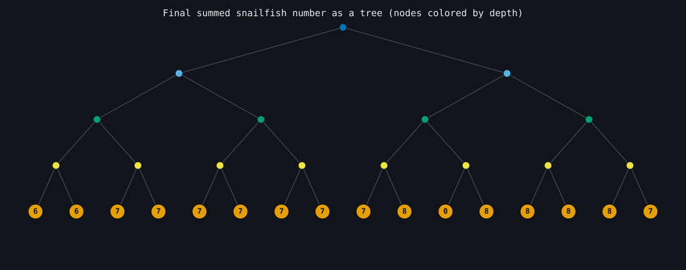
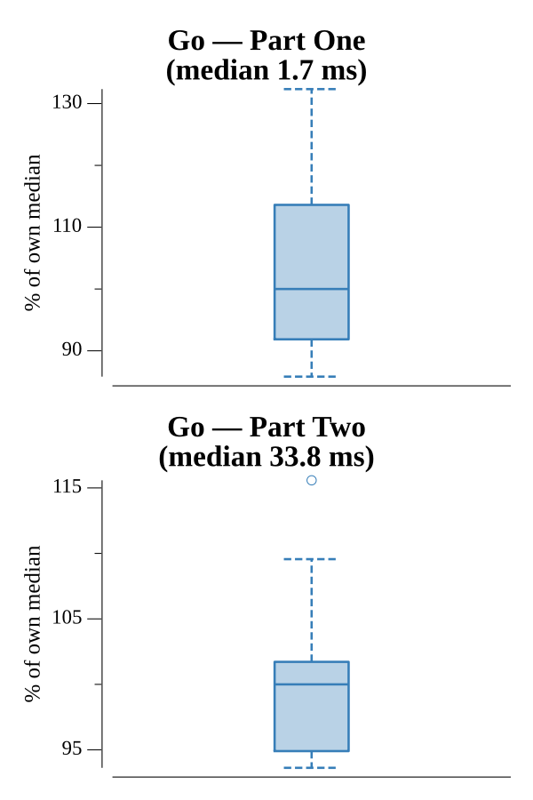

# [Day 18: Snailfish](https://adventofcode.com/2021/day/18)

<!-- These are helper text to make formatting the yearly readme consistent and easier...

[Day 18: Snailfish][rm18]
[Go][go18]

[rm18]: 18-snailfish/README.md
[go18]: 18-snailfish/go

-->

## Notes

The explode/split rules need left- and right-neighbor propagation, which is
awkward on a tree but trivial on a flat list of `(value, depth)` tokens. Explode
finds the first pair at depth 5, adds its halves to the adjacent tokens, and
leaves a 0 at depth 4; split replaces the first value ≥ 10 with two deeper
tokens; magnitude repeatedly folds the deepest adjacent pair as `3*left +
2*right`. Part One sums all numbers and takes the magnitude; Part Two is the best
magnitude over every ordered pair.

## Go

```text
────────────────────────────────────────
─        2021 Day 18: Snailfish        ─
────────────────────────────────────────

Solving (Go)…
1.0:  PASS             2.566ms
2.0:  PASS            46.460ms
```

## Visualization

The final summed number (before taking its magnitude) reconstructed from the flat
tokens and drawn as a binary tree (SVG). Internal nodes are pairs, leaves are the
regular numbers, and depth runs top to bottom — after a full reduction every leaf
sits at exactly depth four, which is why the tree comes out perfectly balanced.
Nodes are colored by depth, but depth also reads from the row position, so the
structure is clear in grayscale.



## Run Times


