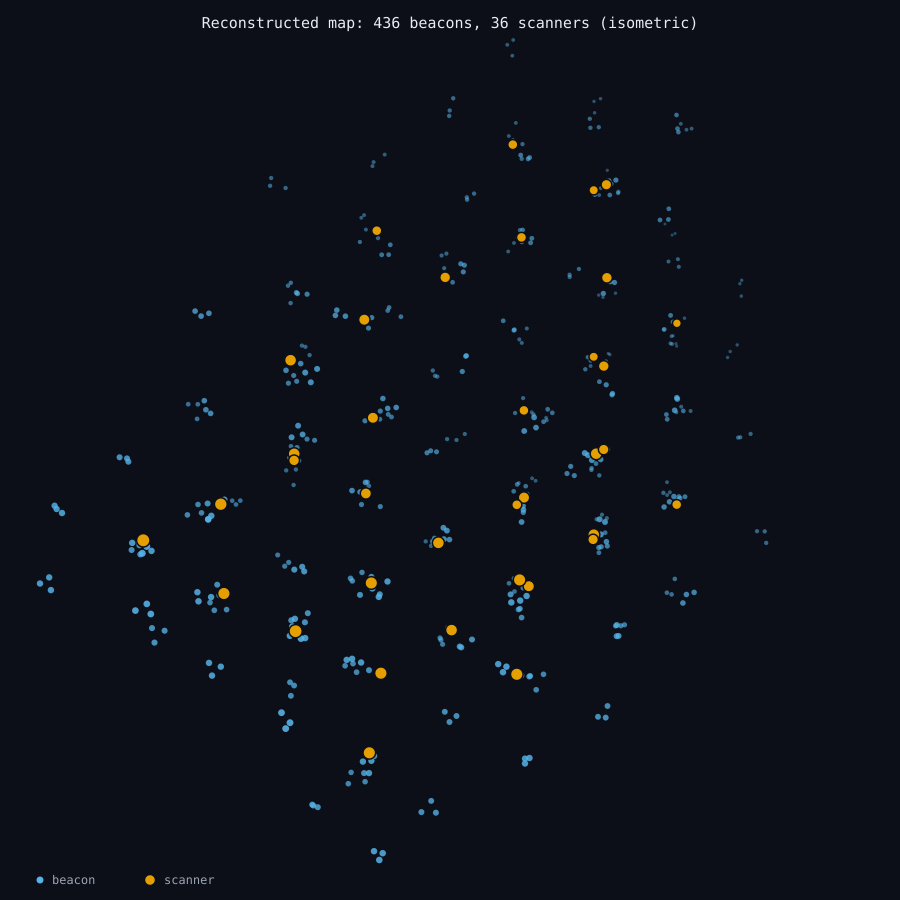
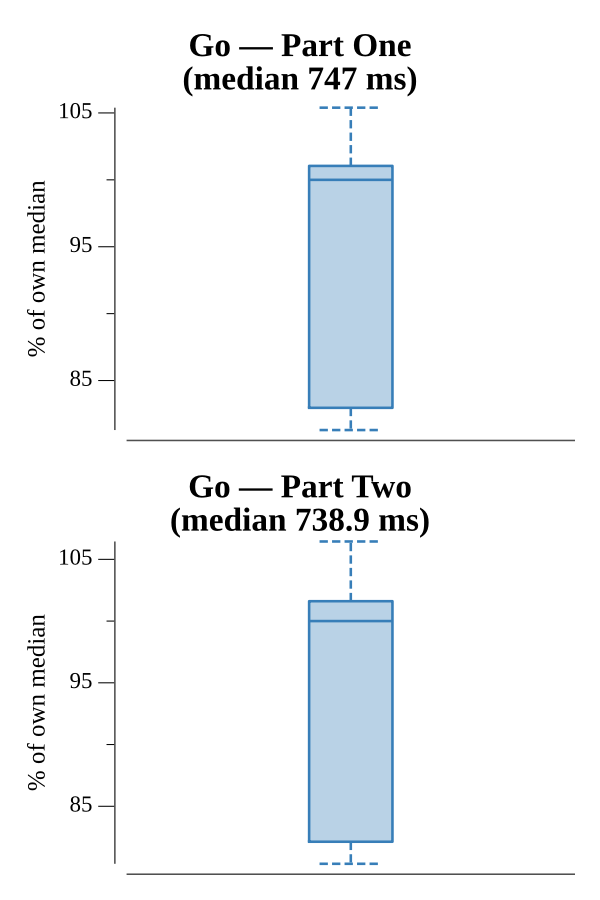

# [Day 19: Beacon Scanner](https://adventofcode.com/2021/day/19)

<!-- These are helper text to make formatting the yearly readme consistent and easier...

[Day 19: Beacon Scanner][rm19]
[Go][go19]

[rm19]: 19-beaconScanner/README.md
[go19]: 19-beaconScanner/go

-->

## Notes

Reconstruct the map by aligning scanners that share ≥ 12 beacons. To test two
scanners, try each of the 24 axis-aligned rotations of one and count the
`known - rotated` offset vectors; an offset shared by 12 or more beacon pairs is
the translation that aligns them. Starting from scanner 0, repeatedly absorb any
scanner that now aligns until all are placed. Part One counts the distinct
beacons; Part Two is the largest Manhattan distance between two scanner
positions. Parsing groups lines under each `--- scanner ---` header so it works
with or without blank-line separators.

## Go

```text
────────────────────────────────────────
─     2021 Day 19: Beacon Scanner      ─
────────────────────────────────────────

Solving (Go)…
1.0:  PASS           613.274ms
2.0:  PASS           599.426ms
```

## Visualization

The fully reconstructed map as an SVG, drawn with an isometric projection. Small
dots are the 436 beacons and larger ringed markers are the 36 located scanner
positions; points are depth-cued (nearer ones bigger and brighter) so the 3D
layout reads on a flat image, and the beacon clusters around each scanner are
visible. Scanners differ from beacons by size and brightness as well as color, so
the two stay distinct in grayscale.



## Run Times


