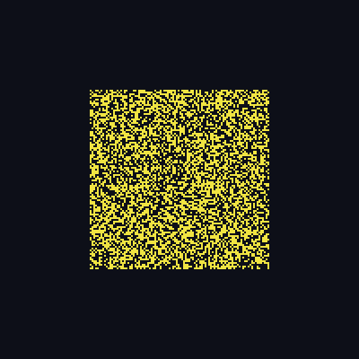
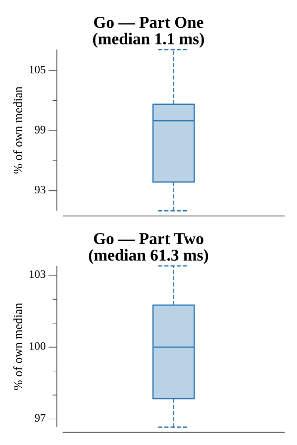

# [Day 20: Trench Map](https://adventofcode.com/2021/day/20)

<!-- These are helper text to make formatting the yearly readme consistent and easier...

[Day 20: Trench Map][rm20]
[Go][go20]

[rm20]: 20-trenchMap/README.md
[go20]: 20-trenchMap/go

-->

## Notes

Each output pixel is the 3×3 neighborhood read as a 9-bit index into the
512-entry algorithm. The catch is the infinite background: if `algo[0]` is `#`,
all the empty space flips lit on odd steps (and back on even steps, since the
all-lit index must map to `.`). The image tracks a `bg` value that toggles
accordingly, and pixels outside the known window sample it. The window grows a
ring each step. Part One runs 2 enhancements, Part Two runs 50.

## Go

```text
────────────────────────────────────────
─       2021 Day 20: Trench Map        ─
────────────────────────────────────────

Solving (Go)…
1.0:  PASS             1.170ms
2.0:  PASS            62.554ms
```

## Visualization

The enhancement animated (GIF), one frame per step. The picture grows a ring each
step and gains detail, spreading from the center into an organic blob; when the
algorithm lights empty space, the infinite background flickers on for odd steps.
Lit pixels are bright on a dark background — a single lit color, so the structure
reads by brightness in grayscale.



## Run Times


