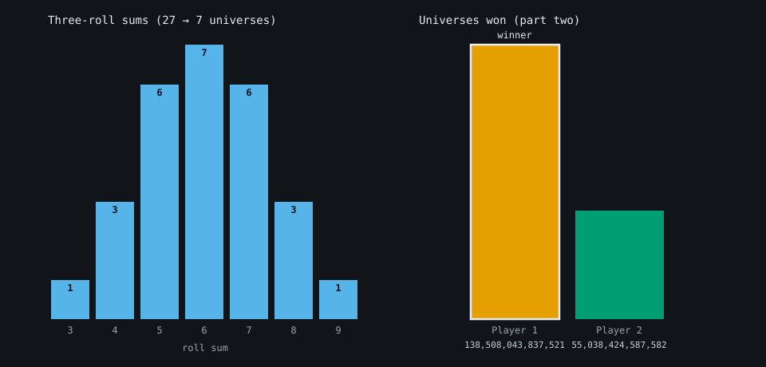
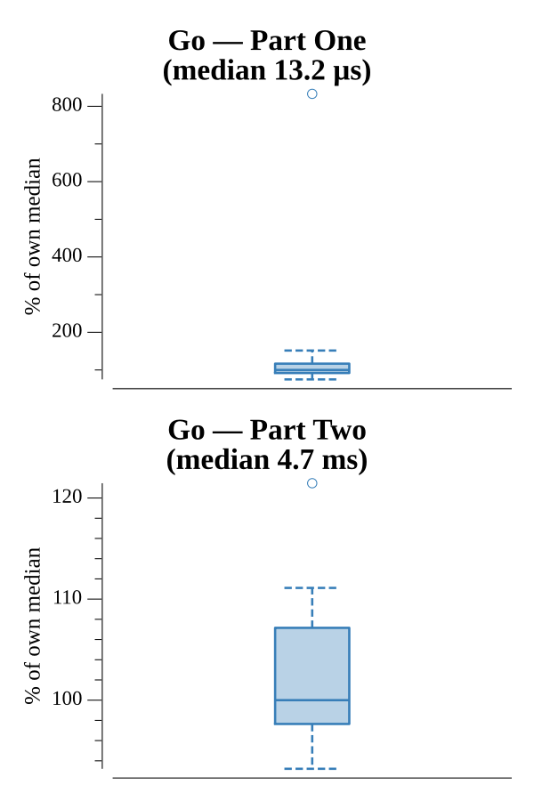

# [Day 21: Dirac Dice](https://adventofcode.com/2021/day/21)

<!-- These are helper text to make formatting the yearly readme consistent and easier...

[Day 21: Dirac Dice][rm21]
[Go][go21]

[rm21]: 21-diracDice/README.md
[go21]: 21-diracDice/go

-->

## Notes

Part One is a straight simulation of the deterministic 100-sided die (losing
score × total rolls). Part Two is the interesting one: the 3-sided quantum die
rolled three times gives 27 universes that collapse to seven distinct sums (3..9)
with multiplicities 1,3,6,7,6,3,1. A memoized recursion over the state
`(pos1, pos2, score1, score2)` returns each player's win count, recursing on each
sum weighted by its multiplicity. The state space is tiny, so memoization makes
it instant.

## Go

```text
────────────────────────────────────────
─       2021 Day 21: Dirac Dice        ─
────────────────────────────────────────

Solving (Go)…
1.0:  PASS             0.013ms
2.0:  PASS             5.515ms
```

## Visualization

Two SVG panels showing what drives the quantum game. The left panel is the
roll-sum distribution — the 27 universes of three quantum rolls collapsing to
seven sums with multiplicities 1,3,6,7,6,3,1, the weights the whole search
branches on. The right panel compares how many universes each player wins (part
two), with the winner outlined. Bars are labeled with their values, so the chart
reads without relying on color.



## Run Times


