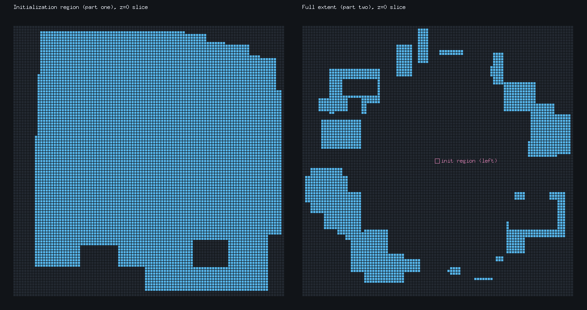
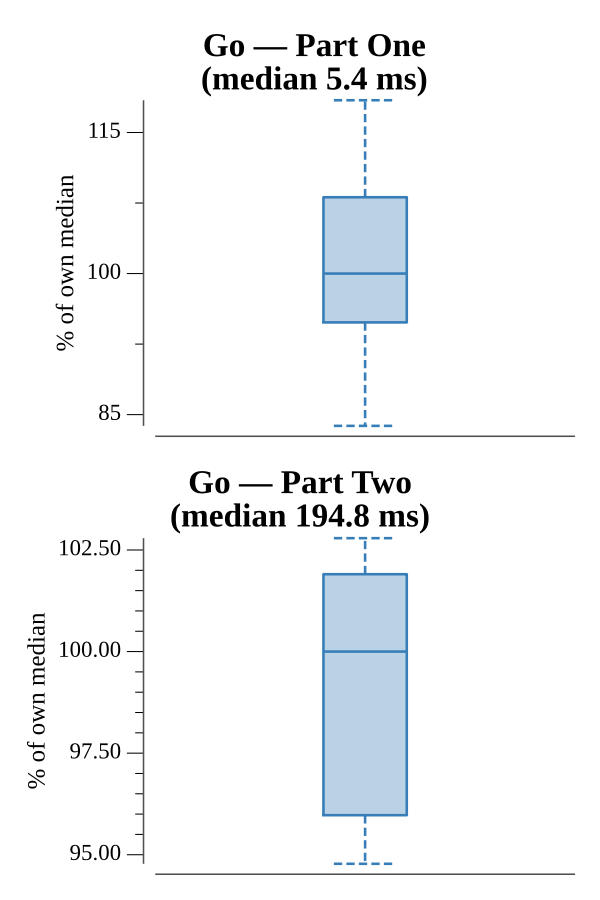

# [Day 22: Reactor Reboot](https://adventofcode.com/2021/day/22)

<!-- These are helper text to make formatting the yearly readme consistent and easier...

[Day 22: Reactor Reboot][rm22]
[Go][go22]

[rm22]: 22-reactorReboot/README.md
[go22]: 22-reactorReboot/go

-->

## Notes

The reactor is a 3D grid toggled by a sequence of "on"/"off" cuboids. A voxel
grid works for Part One (clipped to the -50..50 initialization region) but is
hopeless for Part Two, where cuboids span millions of units per axis.

Both parts use the same signed inclusion-exclusion accounting. Each step, for
every box already tracked, the overlap with the new cuboid is added back with the
opposite sign — cancelling the region that would otherwise be double-counted. An
"on" step also adds itself as a positive box; an "off" step adds only the
cancelling intersections. The answer is the sum of all signed volumes. This keeps
the box list small and avoids materializing any voxels.

## Go

```text
────────────────────────────────────────
─     2021 Day 22: Reactor Reboot      ─
────────────────────────────────────────

Solving (Go)…
1.0:  PASS             6.904ms
2.0:  PASS           212.436ms
```

## Visualization

Two z=0 cross-sections of the reactor. The left panel zooms into the -50..50
initialization region (Part One), where the layered on/off steps carve visible
pockets out of the on volume. The right panel pulls back to the full coordinate
extent of every step (Part Two): the initialization region shrinks to a small
marker at center while the giant far-field cuboids scatter across the plane —
the reason a voxel grid is infeasible and a signed-cuboid count is needed. On
cells are bright, off (carved-out) cells are dark, so brightness carries the
meaning without relying on color.



## Run Times


