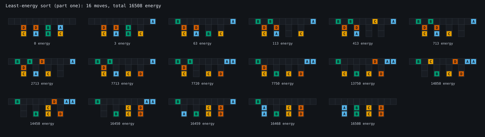
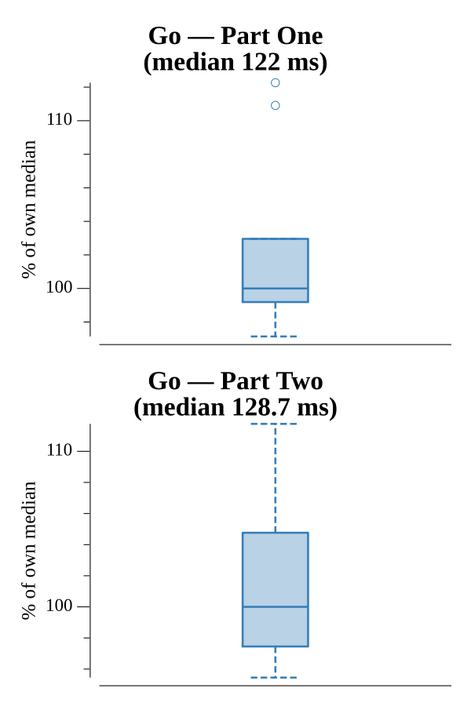

# [Day 23: Amphipod](https://adventofcode.com/2021/day/23)

<!-- These are helper text to make formatting the yearly readme consistent and easier...

[Day 23: Amphipod][rm23]
[Go][go23]

[rm23]: 23-amphipod/README.md
[go23]: 23-amphipod/go

-->

## Notes

Sorting the amphipods into their rooms is a shortest-path problem: each burrow
configuration is a graph node, each legal move an edge weighted by energy
(`steps × {A:1, B:10, C:100, D:1000}`). Dijkstra over states finds the least
total energy.

The whole difficulty is encoding the rules as move generation, not as search
pruning. From any state an amphipod may only either (a) leave its room for a
hallway cell — never stopping on the four cells directly above rooms — or (b)
move straight into its own destination room, and only when that room holds no
wrong-type occupants. With those two generators every state has few successors
and the search stays small.

The solver reads room depth from the parsed input, so Part Two reuses it
unchanged: `Two` simply inserts the two fixed rows (`DCBA` over `DBAC`) into the
folded input to make four-deep rooms.

## Go

```text
────────────────────────────────────────
─        2021 Day 23: Amphipod         ─
────────────────────────────────────────

Solving (Go)…
1.0:  PASS           132.267ms
2.0:  PASS           127.599ms
```

## Visualization

The least-energy sort of the folded (Part One) burrow, drawn as a strip of
successive states: the 11-cell hallway over four rooms, stepping through all 16
moves to the sorted goal. Each amphipod is labeled A–D and colored on a
colorblind-safe palette, so type reads by letter as well as hue. The cumulative
energy under each burrow shows where the cost accumulates — the large jumps are
the expensive D moves (1000 energy per step).



## Run Times


