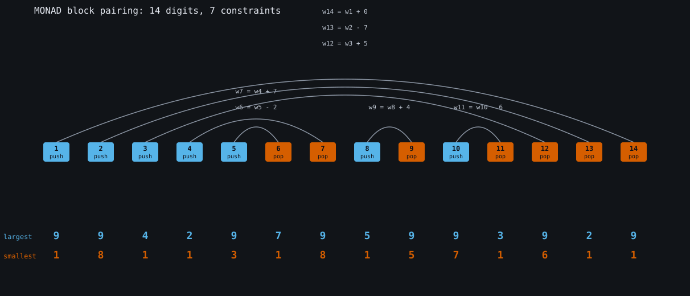
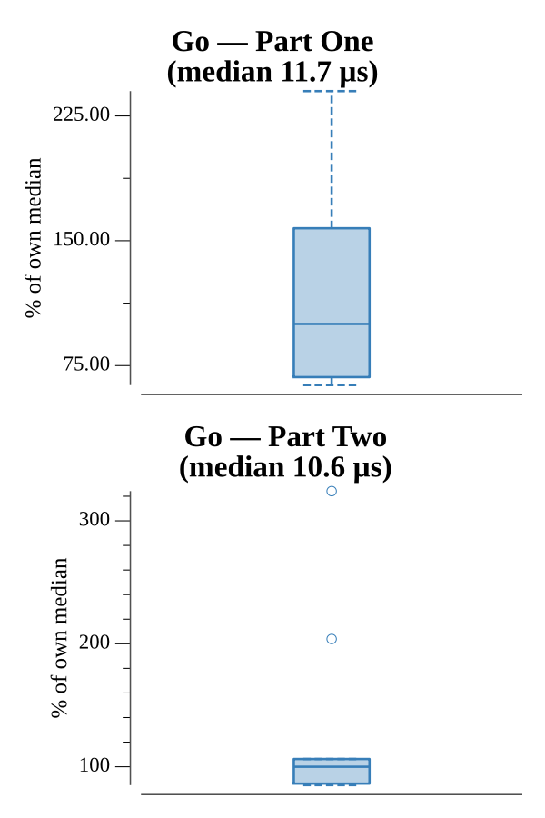

# [Day 24: Arithmetic Logic Unit](https://adventofcode.com/2021/day/24)

<!-- These are helper text to make formatting the yearly readme consistent and easier...

[Day 24: Arithmetic Logic Unit][rm24]
[Go][go24]

[rm24]: 24-arithmeticLogicUnit/README.md
[go24]: 24-arithmeticLogicUnit/go

-->

## Notes

The MONAD program is 14 near-identical blocks, one per input digit, differing
only in three parameters: `div z A` (A is 1 or 26), `add x B`, and `add y C`.
Reading the assembly, each block treats `z` as a base-26 stack:

- A block with `A = 1` always **pushes** `w + C` (its `B` is large enough that the
  equality test can never hold).
- A block with `A = 26` **pops** and only leaves `z` reducible toward 0 when
  `w == (z % 26) + B`.

Pairing each pop with the push it cancels (via a stack) turns "z ends at 0" into
seven linear constraints of the form `w_pop = w_push + delta`. That collapses the
14 free digits to 7, so the largest and smallest valid model numbers are read off
directly by choosing each independent digit at its extreme — no search of the
9^14 space. Both answers verify by running them back through an ALU interpreter of
the real program (`z == 0`).

## Go

```text
────────────────────────────────────────
─  2021 Day 24: Arithmetic Logic Unit  ─
────────────────────────────────────────

Solving (Go)…
1.0:  PASS            14.793µs
2.0:  PASS             8.839µs
```

## Visualization

The 14 blocks drawn as a row, each marked push (`div z 1`) or pop (`div z 26`).
An arc joins every pop to the push it cancels, labeled with the constraint
`w_pop = w_push + delta` linking the two digits. The arcs are nested and never
cross — they are exactly the base-26 stack structure — and the seven of them are
what determine the answer without search. Below each column the largest (Part
One) and smallest (Part Two) digits are shown. Push versus pop is labeled, so the
diagram reads without relying on color.



## Run Times


