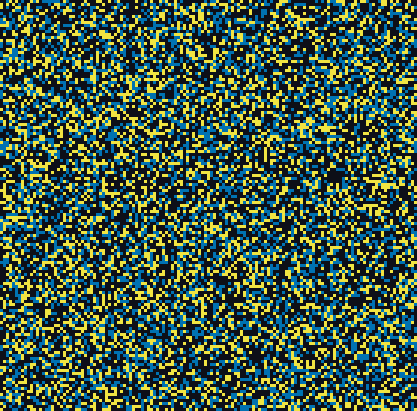
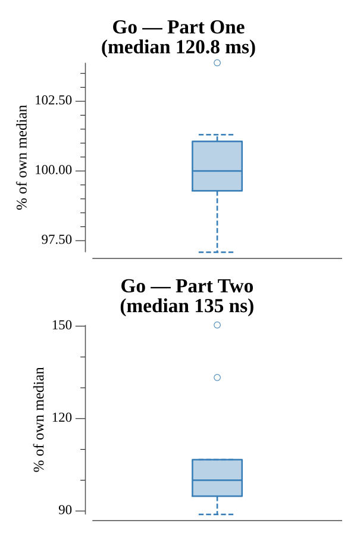

# [Day 25: Sea Cucumber](https://adventofcode.com/2021/day/25)

<!-- These are helper text to make formatting the yearly readme consistent and easier...

[Day 25: Sea Cucumber][rm25]
[Go][go25]

[rm25]: 25-seaCucumber/README.md
[go25]: 25-seaCucumber/go

-->

## Notes

A cellular automaton on a torus. Each step the east-facing herd (`>`) moves
first, then the south-facing herd (`v`). Within a herd every cucumber evaluates
against a single snapshot and moves simultaneously — a cucumber moves only if the
cell ahead (wrapping around the edge) is empty. The answer is the first step on
which nothing moves.

The one subtlety is phasing: the east herd must fully resolve before the south
herd looks at the grid, so the two sweeps use separate snapshots. Interleaving
per cell would let a cucumber move twice in one step.

As the day 25 finale, Part Two is the free star awarded for completing every
other day, so it simply returns "Merry Christmas!".

## Go

```text
────────────────────────────────────────
─      2021 Day 25: Sea Cucumber       ─
────────────────────────────────────────

Solving (Go)…
1.0:  PASS           109.008ms
2.0:  PASS             0.000ms
```

## Visualization

The herds settling into gridlock, animated. The east herd is bright yellow and
the south herd is dark blue over a near-black seafloor — two colors chosen for a
wide luminance gap, so the flows stay distinct in grayscale as well as color. The
animation samples steps to stay small while still showing the herds sliding into
diagonal bands, congesting, and finally freezing.



## Run Times


