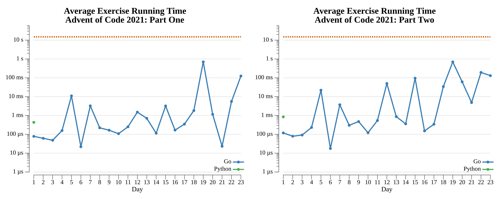

# Advent of Code: 2021

[Advent of Code 2021](https://adventofcode.com/2021) exercise solutions.

<!-- ★ ☆ -->

| Exercise                                      | Stars | Solutions                                          |
|-----------------------------------------------|:-----:|----------------------------------------------------|
| [Day 1: Sonar Sweep](01-sonarSweep/README.md) |  ★ ★  | [Go](01-sonarSweep/go), [Python](01-sonarSweep/py) |
| [Day 2: Dive!](02-dive/README.md)             |  ★ ★  | [Go](02-dive/go)                                   |
| [Day 3: Binary Diagnostic](03-binaryDiagnostic/README.md) |  ★ ★  | [Go](03-binaryDiagnostic/go)                       |
| [Day 4: Giant Squid](04-giantSquid/README.md) |  ★ ★  | [Go](04-giantSquid/go)                             |
| [Day 5: Hydrothermal Venture](05-hydrothermalVenture/README.md) |  ★ ★  | [Go](05-hydrothermalVenture/go)                    |
| [Day 6: Lanternfish](06-lanternfish/README.md) |  ★ ★  | [Go](06-lanternfish/go)                            |
| [Day 7: The Treachery of Whales](07-theTreacheryOfWhales/README.md) |  ★ ★  | [Go](07-theTreacheryOfWhales/go)                   |
| [Day 8: Seven Segment Search](08-sevenSegmentSearch/README.md) |  ★ ★  | [Go](08-sevenSegmentSearch/go)                     |
| [Day 9: Smoke Basin](09-smokeBasin/README.md) |  ★ ★  | [Go](09-smokeBasin/go)                             |
| [Day 10: Syntax Scoring](10-syntaxScoring/README.md) |  ★ ★  | [Go](10-syntaxScoring/go)                          |
| [Day 11: Dumbo Octopus](11-dumboOctopus/README.md) |  ★ ★  | [Go](11-dumboOctopus/go)                           |
| [Day 12: Passage Pathing](12-passagePathing/README.md) |  ★ ★  | [Go](12-passagePathing/go)                         |
| [Day 13: Transparent Origami](13-transparentOrigami/README.md) |  ★ ★  | [Go](13-transparentOrigami/go)                     |
| [Day 14: Extended Polymerization](14-extendedPolymerization/README.md) |  ★ ★  | [Go](14-extendedPolymerization/go)                 |
| [Day 15: Chiton](15-chiton/README.md)         |  ★ ★  | [Go](15-chiton/go)                                 |
| [Day 16: Packet Decoder](16-packetDecoder/README.md) |  ★ ★  | [Go](16-packetDecoder/go)                          |
| [Day 17: Trick Shot](17-trickShot/README.md)  |  ★ ★  | [Go](17-trickShot/go)                              |
| [Day 18: Snailfish](18-snailfish/README.md)   |  ★ ★  | [Go](18-snailfish/go)                              |
| [Day 19: Beacon Scanner](19-beaconScanner/README.md) |  ★ ★  | [Go](19-beaconScanner/go)                          |
| [Day 20: Trench Map](20-trenchMap/README.md)  |  ★ ★  | [Go](20-trenchMap/go)                              |
| [Day 21: Dirac Dice](21-diracDice/README.md)  |  ★ ★  | [Go](21-diracDice/go)                              |
| [Day 22: Reactor Reboot](22-reactorReboot/README.md) |  ★ ★  | [Go](22-reactorReboot/go)                          |
| [Day 23: Amphipod](23-amphipod/README.md)     |  ★ ★  | [Go](23-amphipod/go)                               |
| 24                                            |  ☆ ☆  |                                                    |
| 25                                            |  ☆ ☆  |                                                    |

## 2021 Run Times



## 2021 Personal Leaderboard

```text
      --------Part 1---------   --------Part 2---------
Day       Time    Rank  Score       Time    Rank  Score
  2       >24h  200619      0       >24h  192670      0
  1       >24h  240779      0       >24h  213529      0
```
