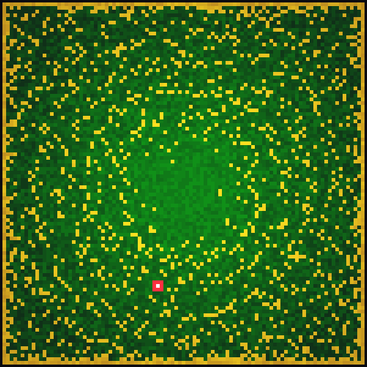
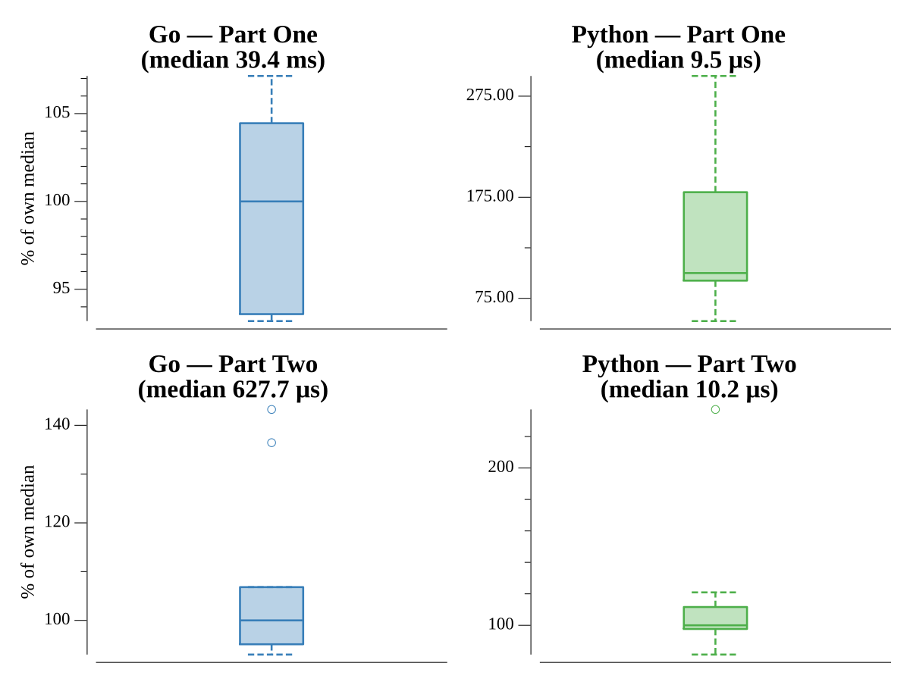

# [Day 8: Treetop Tree House](https://adventofcode.com/2022/day/8)

## Notes

Part One sweeps each row and column from all four edges, marking a tree visible
when it is taller than everything seen so far along that line. Part Two walks
outward from each interior tree in the four directions to find its viewing
distance and keeps the best product.

## Go

```text
────────────────────────────────────────
─    2022 Day 8: Treetop Tree House    ─
────────────────────────────────────────

Solving (Go)…
1.0:  PASS            44.925ms
2.0:  PASS             0.611ms
```

## Visualization

The forest as a height-shaded grid. Trees visible from outside the grid (part
one) glow gold and cluster along the perimeter and ridgelines, while the
sheltered interior trees stay dark green — so the visible set thins toward the
center. The single tree with the best scenic score (part two) is ringed in red.



## Run Times


