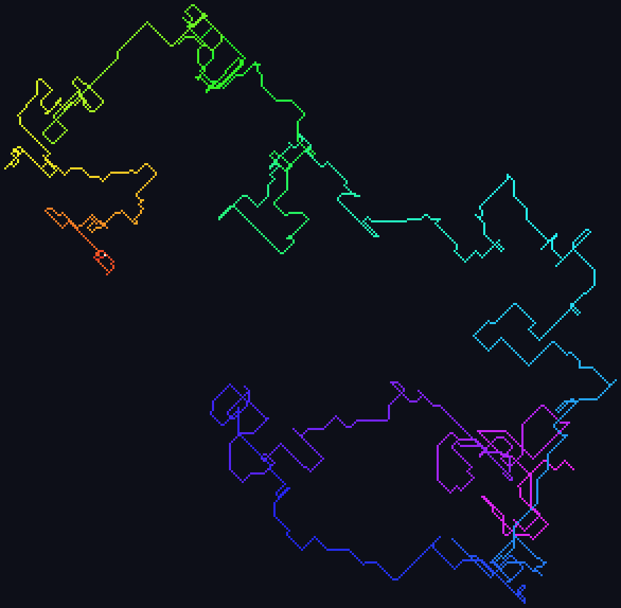
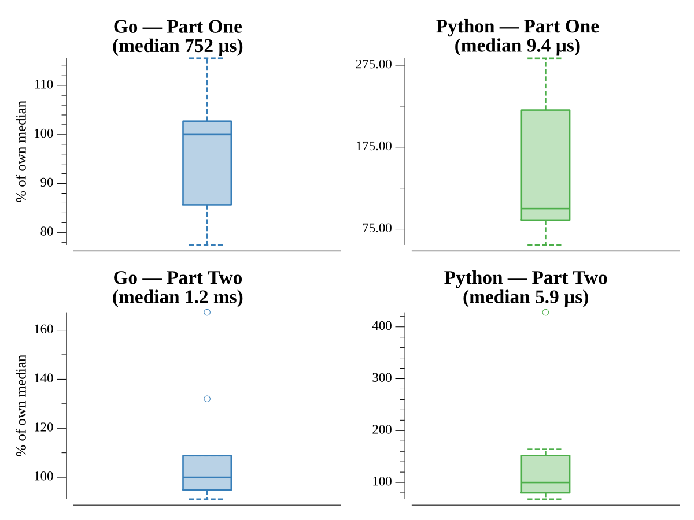

# [Day 9: Rope Bridge](https://adventofcode.com/2022/day/9)

## Notes

The rope is a chain of knots; each knot follows the one ahead of it by the
standard "step toward it when not touching" rule. Part One tracks a two-knot
rope, Part Two a ten-knot rope, counting the distinct cells the tail visits.

## Go

```text
────────────────────────────────────────
─       2022 Day 9: Rope Bridge        ─
────────────────────────────────────────

Solving (Go)…
1.0:  PASS             0.812ms
2.0:  PASS             1.296ms
```

## Visualization

The path swept by the tail of the ten-knot rope (part two). Each visited cell is
colored by the order it was first reached — a hue gradient from the start (red)
through the spectrum — so the looping, self-crossing route the rope drags across
the grid is easy to follow. The origin is marked white.



## Run Times


