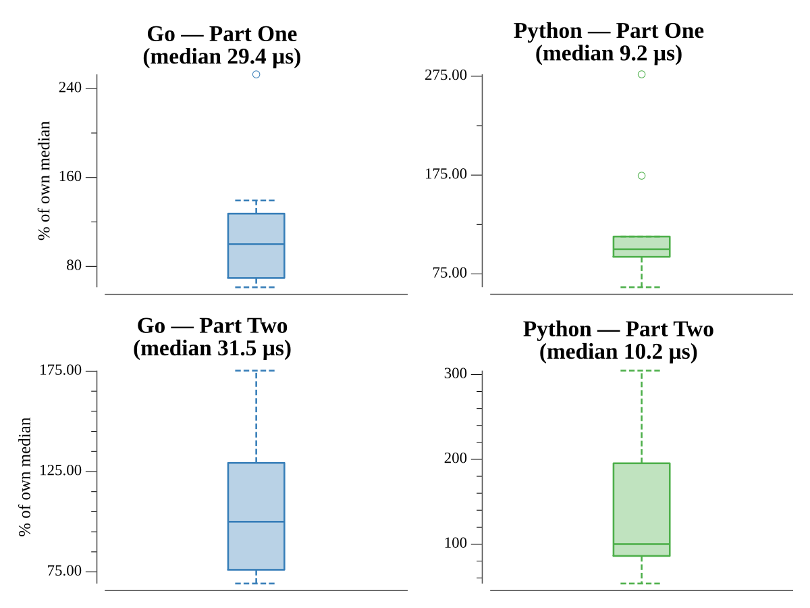

# [Day 10: Cathode-Ray Tube](https://adventofcode.com/2022/day/10)

## Notes

A tiny two-instruction CPU drives a single X register. Part One sums the signal
strength at six sampled cycles. Part Two treats the register as the position of
a 3-pixel sprite and lights a 40×6 CRT wherever the sprite overlaps the beam;
the lit pixels spell out eight capital letters.

## Go

```text
────────────────────────────────────────
─    2022 Day 10: Cathode-Ray Tube     ─
────────────────────────────────────────

Solving (Go)…
1.0:  PASS            24.070µs
2.0:  PASS            44.666µs
```

## Visualization

The CRT output rendered as a clean raster: lit pixels on a warm glow, dark
pixels as faint scanline cells. The eight letters it spells are the part-two
answer.


## Run Times


