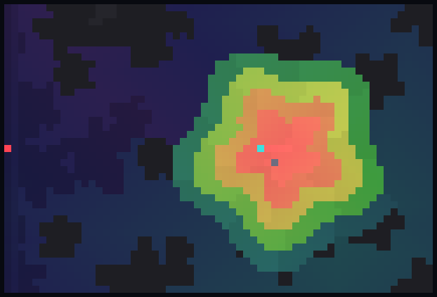
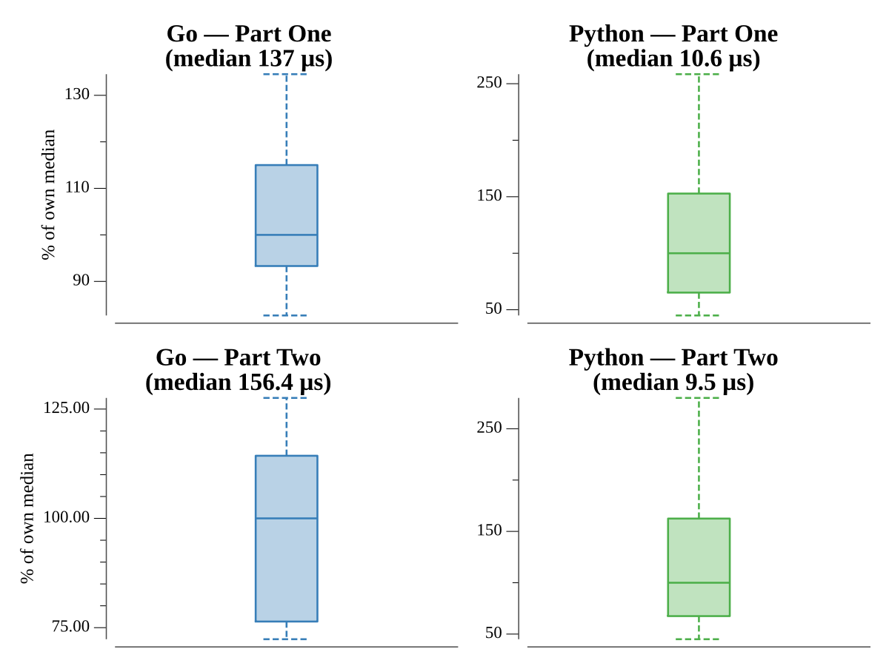

# [Day 12: Hill Climbing Algorithm](https://adventofcode.com/2022/day/12)

## Notes

Both parts are shortest paths on the same grid, so a single breadth-first search
run *backwards from the summit* answers both at once: the reverse climb rule lets
a step drop by at most one level, and one pass labels every reachable cell with
its distance to the end. Part One reads off the distance at the start tile; Part
Two takes the minimum distance over all elevation-`a` cells. This replaced an
earlier version that ran a separate Dijkstra from every low point (≈3.8s → sub-ms).

## Go

```text
────────────────────────────────────────
─ 2022 Day 12: Hill-Climbing Algorithm ─
────────────────────────────────────────

Solving (Go)…
1.0:  PASS           251.087µs
2.0:  PASS           120.874µs
```

## Visualization

The height map as shaded relief (dark low ground to bright ridges) with the
single-source distance field overlaid: reachable cells are tinted by how many
steps they sit from the end, producing concentric contour rings radiating out
from the summit like a topographic map. The start is red, the end cyan, and the
steep unreachable walls stay dark.



## Run Times


