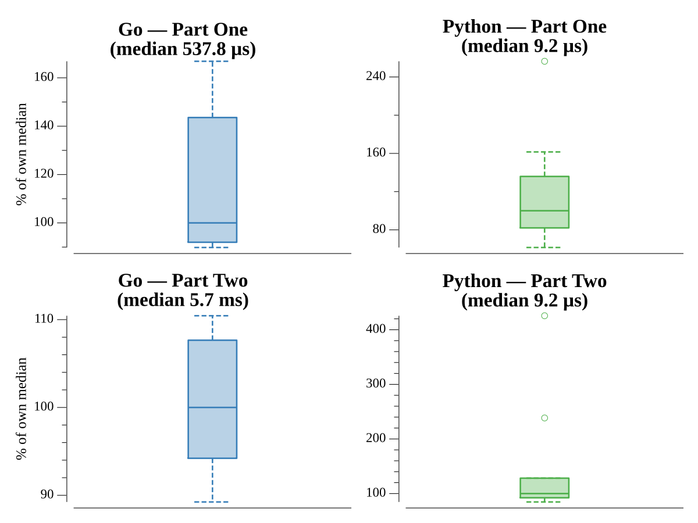

# [Day 14: Regolith Reservoir](https://adventofcode.com/2022/day/14)

## Notes

Sand pours from 500,0 one unit at a time, each unit falling down / down-left /
down-right until it rests. Part One counts units before sand starts falling into
the void; Part Two adds an infinite floor two below the lowest rock and counts
until the source itself is blocked.

## Go

```text
────────────────────────────────────────
─   2022 Day 14: Regolith Reservoir    ─
────────────────────────────────────────

Solving (Go)…
1.0:  PASS             0.705ms
2.0:  PASS             5.787ms
```

## Visualization

The fully settled pile from part two (with the floor). Rock is slate; settled
sand is gold, shaded by depth so the internal packing is visible. The rock
formations show up as dark voids — the shadows they cast in the sand flow — under
the characteristic pyramid that fans out from the source down to the floor.


## Run Times


