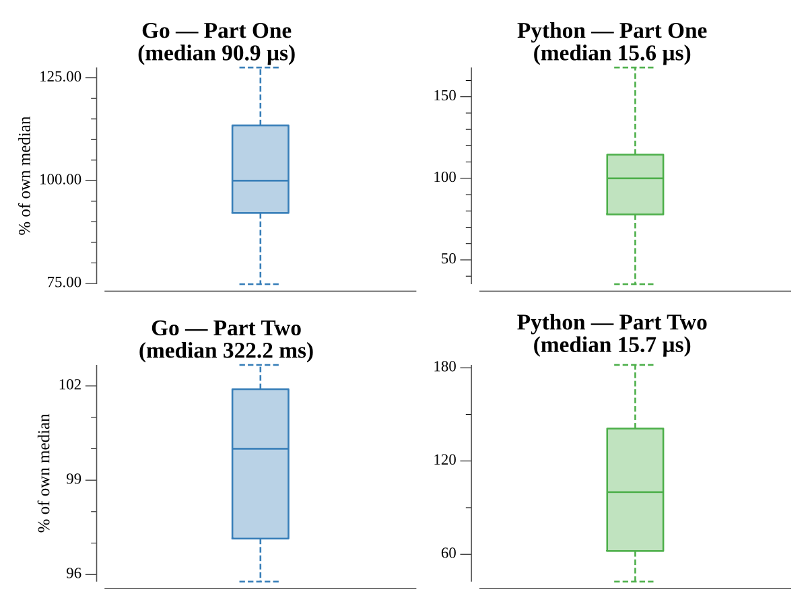

# [Day 15: Beacon Exclusion Zone](https://adventofcode.com/2022/day/15)

## Notes

Each sensor covers a Manhattan-distance diamond. Part One asks how many cells on
one row are covered: rather than materialising every cell, each sensor's coverage
on that row is a contiguous span, so the spans are merged and their widths summed
(≈2.7s → sub-ms). Part Two finds the single uncovered cell in a 4-million-square
box by walking the perimeter just outside each sensor's diamond.

## Go

```text
────────────────────────────────────────
─  2022 Day 15: Beacon Exclusion Zone  ─
────────────────────────────────────────

Solving (Go)…
1.0:  PASS             0.100ms
2.0:  PASS           313.689ms
```

## Run Times


