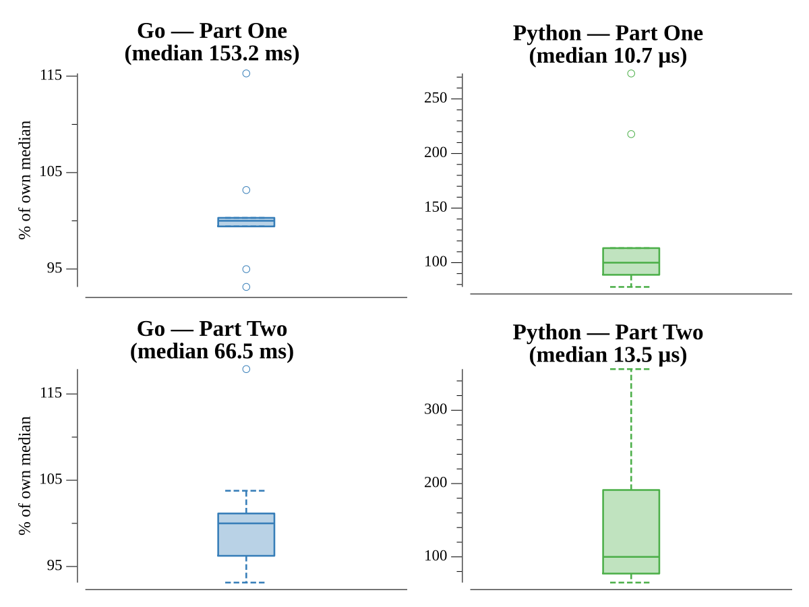

# [Day 16: Proboscidea Volcanium](https://adventofcode.com/2022/day/16)

## Notes

The zero-flow valves are just corridors, so the graph is collapsed to
all-pairs shortest paths between the useful valves with
[Floyd-Warshall](https://en.wikipedia.org/wiki/Floyd%E2%80%93Warshall_algorithm),
then a DFS enumerates the flow achievable for every reachable set of opened
valves. Part One keeps the best. Part Two (you + an elephant, 26 minutes each)
collapses those paths to the best flow per *set of valves* — encoded as a
bitmask — and pairs every two disjoint sets with a single bitwise AND, instead of
the old O(n²) map-overlap scan (which timed out; now ≈70ms).

## Go

```text
────────────────────────────────────────
─  2022 Day 16: Proboscidea Volcanium  ─
────────────────────────────────────────

Solving (Go)…
1.0:  PASS           161.062ms
2.0:  PASS            68.467ms
```

## Visualization

`elf visualize` emits a [Mermaid](https://mermaid.js.org/) `flowchart` of the
tunnel network (`vis.mmd`) — each valve labeled with its flow rate and wired to
its neighbors — for rendering the cave layout the search runs over.

## Run Times


