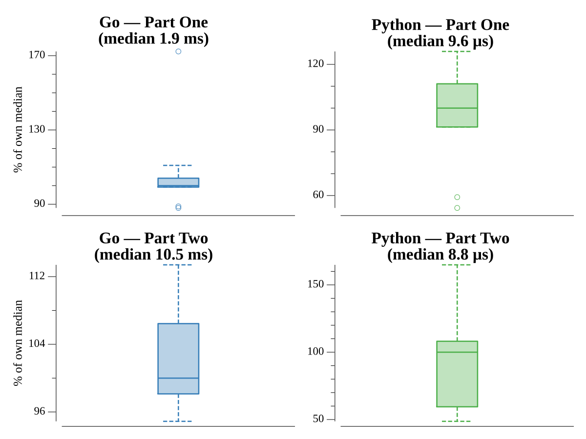

# [Day 17: Pyroclastic Flow](https://adventofcode.com/2022/day/17)

## Notes

Tetris-shaped rocks fall into a seven-wide chamber, pushed by a repeating jet
pattern. Part One drops 2022 rocks. Part Two drops one trillion, which is
tractable because the (jet index, rock index, top-profile) state eventually
repeats — detect the cycle, fast-forward whole cycles, and add the remainder.

## Go

```text
────────────────────────────────────────
─    2022 Day 17: Pyroclastic Flow     ─
────────────────────────────────────────

Solving (Go)…
1.0:  PASS             1.927ms
2.0:  PASS            11.104ms
```

## Visualization

The bottom of the tower after the part-one drop, laid on its side so it reads as
a wide strip: the base of the tower is at the left and it grows rightward. The
interlocking shapes and the trapped air pockets they leave — the reason the
height is non-trivial to predict — are visible along the whole run.


## Run Times


