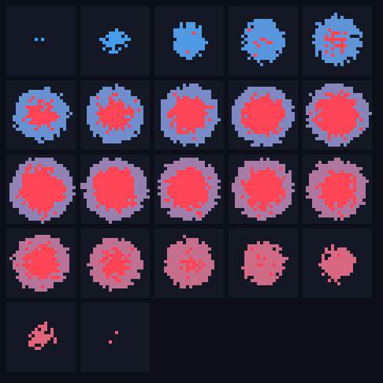
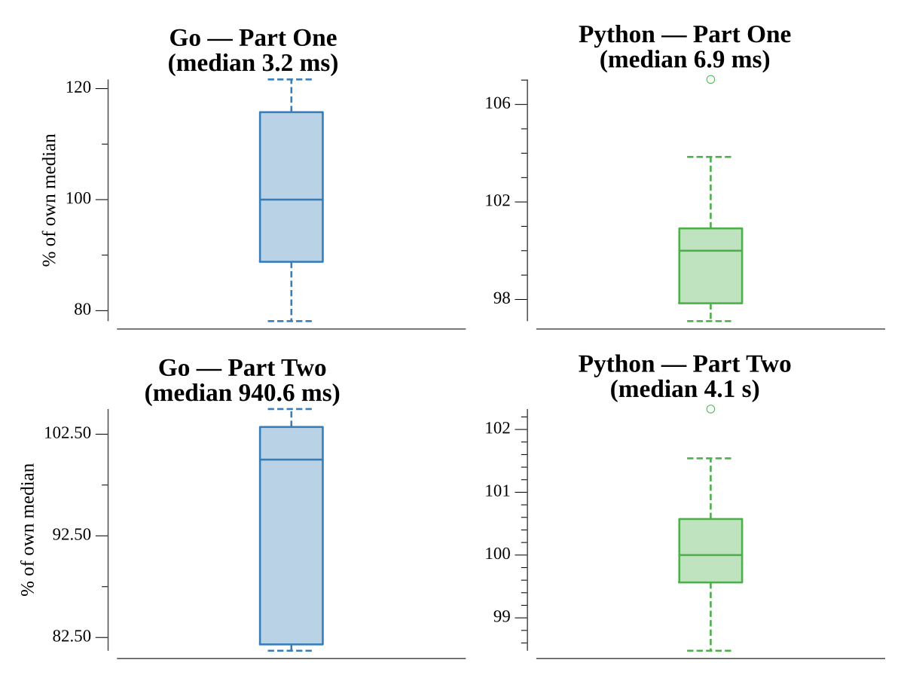

# [Day 18: Boiling Boulders](https://adventofcode.com/2022/day/18)

## Notes

Part One counts exposed faces: six per cube minus one for every shared face
between adjacent cubes. Part Two subtracts the faces bordering trapped interior
air — found by flood-filling the exterior from just outside the bounding box, so
any air cell the flood never reaches is enclosed.

## Go

```text
────────────────────────────────────────
─     2022 Day 18: Boiling Boulders     ─
────────────────────────────────────────

Solving (Go)…
1.0:  PASS             3.321ms
2.0:  PASS           797.248ms
```

## Visualization

The lava droplet as a stack of z-layer slices — a CT-scan contact sheet. Each
panel is one z plane: lava cubes are tinted by depth so the shape reads across
panels, and the trapped interior air that part two subtracts is highlighted red.
This droplet is largely a hollow shell, so the trapped cavity dominates the
middle slices.



## Run Times


