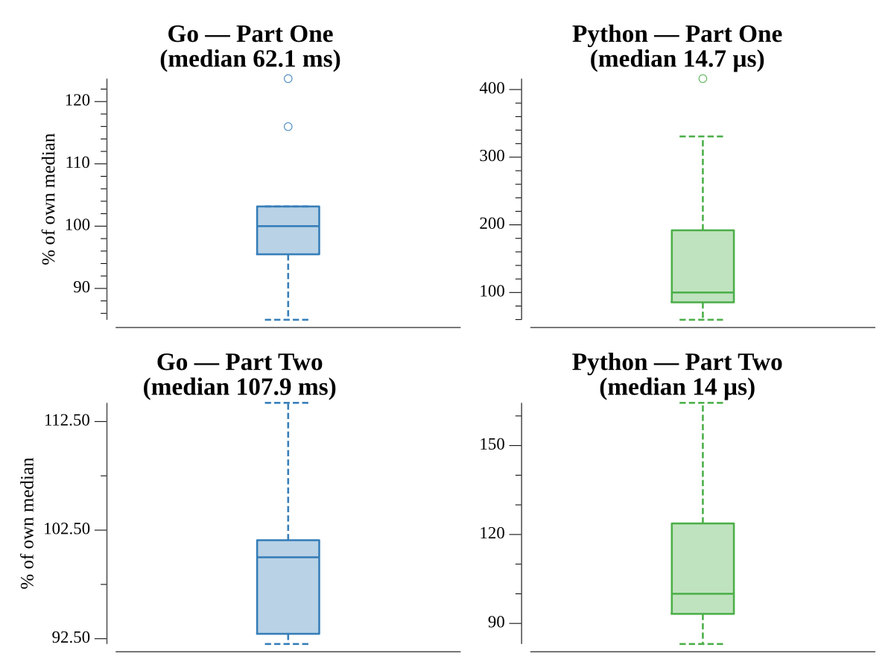

# [Day 19: Not Enough Minerals](https://adventofcode.com/2022/day/19)

## Notes

For each blueprint, find the most geodes obtainable in the time limit. The search
is a branch-and-bound DFS that branches on *which robot to build next*,
fast-forwarding to the minute that robot becomes affordable rather than stepping
one minute at a time. Two prunes keep it fast: never build more of a robot than
the most expensive recipe can consume per minute, and abandon a branch whose
optimistic upper bound (a geode robot every remaining minute) can't beat the best
result found so far. This replaced a per-minute search with a useless state-hash
memo (Part Two ≈47s → sub-100ms).

## Go

```text
────────────────────────────────────────
─   2022 Day 19: Not Enough Minerals   ─
────────────────────────────────────────

Solving (Go)…
1.0:  PASS            40.633ms
2.0:  PASS            88.526ms
```

### Benchmark Notes

I wondered if using a regex for parsing the input would be better; the output of benchstat follows:

```text
goos: linux
goarch: amd64
pkg: github.com/asphaltbuffet/advent-of-code/exercises/2022/19-notEnoughMinerals/go
cpu: Intel(R) Core(TM) i7-9700K CPU @ 3.60GHz
        │   sscanf    │                regex                  │
        │   sec/op    │    sec/op     vs base                 │
Parse-8   5.455µ ± 3%   19.760µ ± 2%  +262.24% (p=0.000 n=15)

        │   sscanf   │                regex                    │
        │    B/op    │     B/op      vs base                   │
Parse-8   158.0 ± 0%   29114.0 ± 0%  +18326.58% (p=0.000 n=15)

        │   sscanf   │                regex                   │
        │ allocs/op  │  allocs/op    vs base                  │
Parse-8   7.000 ± 0%   101.000 ± 0%  +1342.86% (p=0.000 n=15)
```

It's slower, uses more memory, and allocates that memory more often. Regex is **not** the better solution here.

## Run Times


