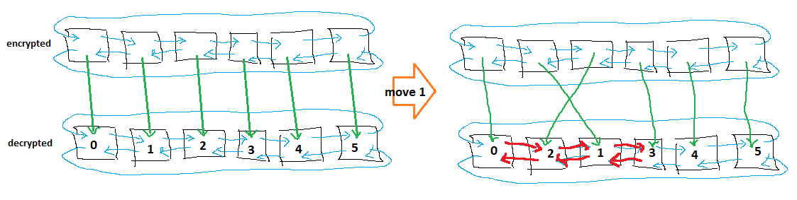

# [Day 20: Grove Positioning System](https://adventofcode.com/2022/day/20)

<!-- [Day 20: Grove Positioning System](20-grovePositioningSystem) -->

Let's do an initial bit of designing with MS Paint:



Later, I changed 'encrypted' to be an array since I would never need to move backward through it or loop end to end...

## Go

```text
2022-20 Grove Positioning System (Golang)

Running...

Test 1.0: pass in 31.7 µs
Test 2.0: pass in 9.6 µs
Part 1: 4066 in 221.4 ms
Part 2: 6704537992933 in 1.5 s
```

## Python

```text
    < section intentionally left blank >
```

## 2022 Run Times


