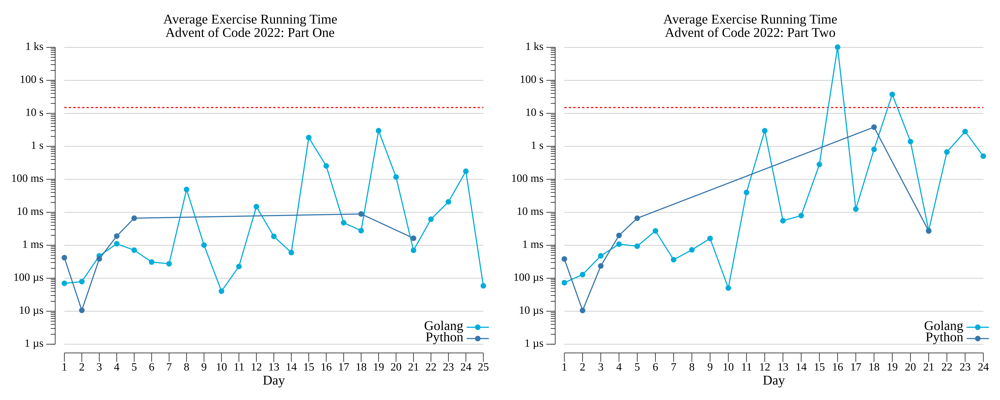

# [Day 21: Monkey Math](https://adventofcode.com/2022/day/21)

<!-- These are helper text to make formatting the yearly readme consistent and easier...

[Day 21: Monkey Math][rm21]
[Go][g21]
[Python][p21]

[rm21]: 21-monkeyMath/README.md
[g21]: 21-monkeyMath/go
[p21]: 21-monkeyMath/py

-->

## Go

```text
2022-21 Monkey Math (Golang)

Running...

Test 1.0: pass in 8.5 µs
Test 2.0: pass in 56.9 µs
Part 1: 49288254556480 in 726 µs
Part 2: 3558714869436 in 5 ms
```

## Python

```text
2022-21 Monkey Math (Python)

Running...

Test 1.0: pass in 19.7 µs
Test 2.0: pass in 46.9 µs
Part 1: 49288254556480 in 1.7 ms
Part 2: 3558714869436 in 2.6 ms
```

## 2022 Run Times


