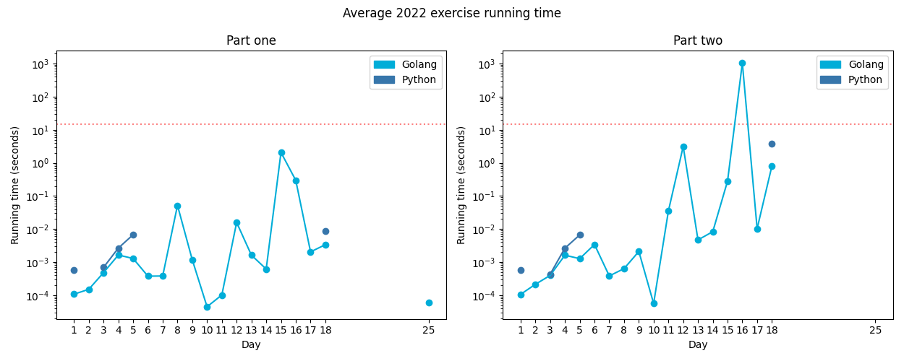

# [Day 22: Monkey Map](https://adventofcode.com/2022/day/22)

<!-- These are helper text to make formatting the yearly readme consistent and easier...

[Day 22: Monkey Map][rm22]
[Go][g22]
[Python][p22]

[rm22]: 22-monkeyMap/README.md
[g22]: 22-monkeyMap/go
[p22]: 22-monkeyMap/py

-->

## Go

```text
2022-22 Monkey Map (Golang)

Running...

Test 1.0: pass in 36.9 µs
Test 2.0: pass in 20 ms
Part 1: 103224 in 4.3 ms
Part 2: 189097 in 924 ms
```

## Python

```text
    < section intentionally left blank >
```

## 2022 Run Times


