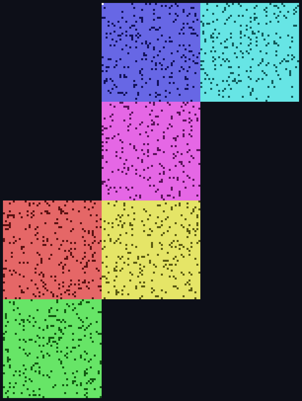
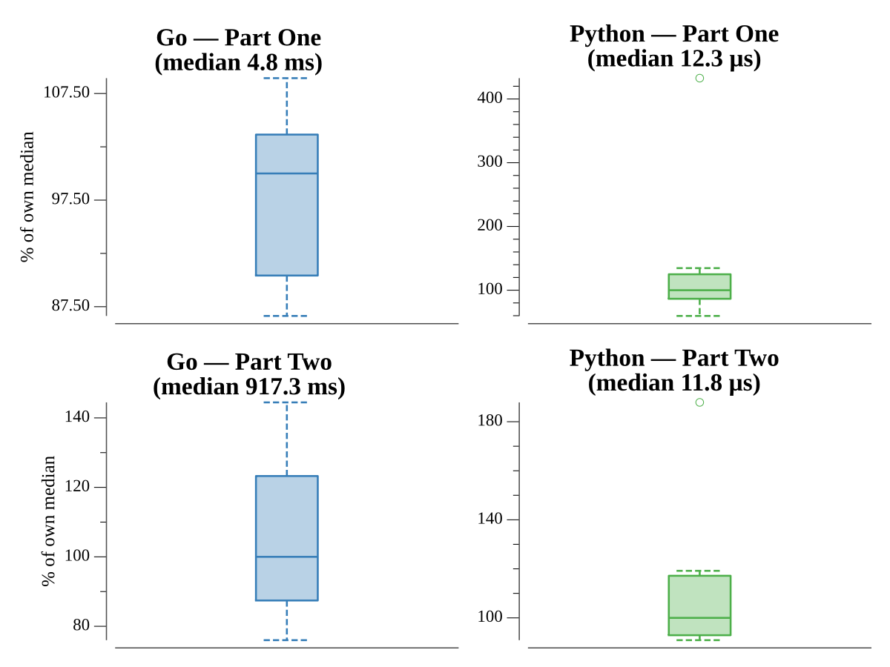

# [Day 22: Monkey Map](https://adventofcode.com/2022/day/22)

## Notes

Follow a path of moves and turns across a board with a hole-y, cross-shaped
layout. Part One wraps at edges within the flat map; Part Two folds the board
into a cube, so walking off one face's edge arrives on the correct edge of the
adjacent face (with the appropriate rotation).

## Go

```text
────────────────────────────────────────
─       2022 Day 22: Monkey Map        ─
────────────────────────────────────────

Solving (Go)…
1.0:  PASS             3.709ms
2.0:  PASS           722.840ms
```

## Visualization

The board — the unfolded cube net — with each of the six blockSize×blockSize
faces given its own hue, so the distinctive staircase fold pattern is obvious.
Open tiles are bright, walls are darkened within their face's color, and the
starting tile is marked white. This is the geometry part two treats as a cube.



## Run Times


