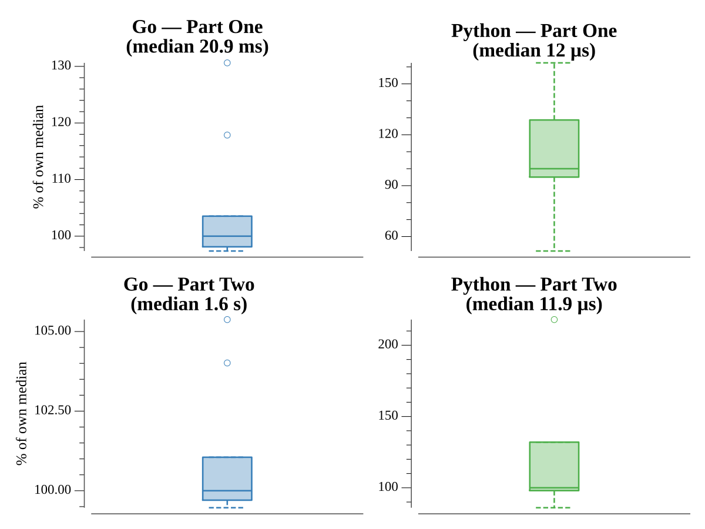

# [Day 23: Unstable Diffusion](https://adventofcode.com/2022/day/23)

## Notes

Elves spread out by a proposal rule: each round every elf proposes a move, and
only elves whose proposal is unique actually move; the checked directions rotate
each round. Part One measures the bounding-rectangle emptiness after 10 rounds.
Part Two runs until nobody moves — detected directly from a "did any elf move
this round?" flag, which replaced hashing the whole board with SHA-1 each round
(≈4s → ≈1.4s).

## Go

```text
────────────────────────────────────────
─   2022 Day 23: Unstable Diffusion    ─
────────────────────────────────────────

Solving (Go)…
1.0:  PASS              0.019s
2.0:  PASS              1.398s
```

## Visualization

The elves spreading out, one frame per round (GIF). Starting from the packed
initial clump, each elf is colored by its distance from the center of mass, so
the outward "boiling" diffusion reads as warm core to cool fringe. The animation
runs through the early spread where the motion is most dramatic.


## Run Times


