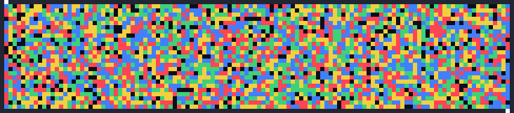
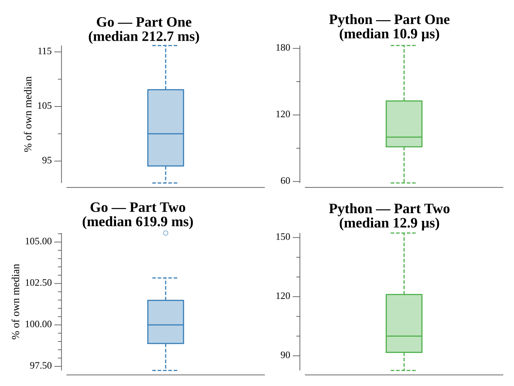

# [Day 24: Blizzard Basin](https://adventofcode.com/2022/day/24)

## Notes

Cross a valley whose blizzards move on a fixed cycle, so the occupied cells at
any minute are fully determined by `minute mod lcm(width,height)`. A BFS over
(position, time) finds the fastest crossing. Part One is one crossing; Part Two
is three (there and back and there again to fetch the snacks).

## Go

```text
────────────────────────────────────────
─     2022 Day 24: Blizzard Basin      ─
────────────────────────────────────────

Solving (Go)…
1.0:  PASS           196.224ms
2.0:  PASS           529.172ms
```

## Visualization

The blizzard field the expedition must thread, one frame per minute (GIF).
Blizzards are color-coded by direction (→ red, ← blue, ↑ green, ↓ yellow), cells
where two or more overlap are white, and the dark gaps are the only safe tiles to
stand on. The entry and exit portals in the walls are marked. It runs for the
duration of the first crossing.



## Run Times


