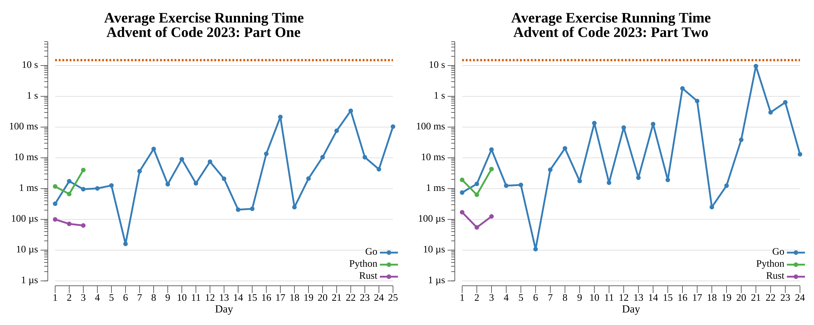

# [Day 3: Gear Ratios](https://adventofcode.com/2023/day/3)

<!-- These are helper text to make formatting the yearly readme consistent and easier...

[Day 3: Gear Ratios][rm3]
[Go][go3]
[Rust][rs3]
[Python][py3]

[rm3]: exercises/2023/03-gearRatios/README.md
[go3]: exercises/2023/03-gearRatios/go
[rs3]: exercises/2023/03-gearRatios/rs
[py3]: exercises/2023/03-gearRatios/py

-->

## Go

```text
 ───────────────────
 ADVENT OF CODE 2023
 Day 3: Gear Ratios
 ───────────────────
  Test 1.0: PASS in 33.2 µs
  Test 2.0: PASS in 16.2 µs
  Part 1: 509115 in 1.1 ms
  Part 2: 75220503 in 29.3 ms
```

## Python

`re.finditer` locates each number's span, and a set comprehension builds its
surrounding cells. Part one keeps numbers whose border set intersects the symbol
set; part two groups numbers by adjacent `*` in a `defaultdict` and sums the
`math.prod` of the pairs.

```text
 ───────────────────
 ADVENT OF CODE 2023
 Day 3: Gear Ratios
 ───────────────────

Solving (Python)…
1.0:  PASS             4.005ms
2.0:  PASS             3.977ms
```

## Rust

The grid is scanned as raw bytes: each digit run becomes a `Number` with its
span, and a single `for_border` closure walks the frame around it — feeding both
the symbol test (part one) and a `HashMap` of gears to their adjacent numbers
(part two). No regex crate; bounds are handled with `saturating_sub`/`min`.

```text
 ───────────────────
 ADVENT OF CODE 2023
 Day 3: Gear Ratios
 ───────────────────

Solving (Rust)…
1.0:  PASS            71.819µs
2.0:  PASS           155.675µs
```

## 2023 Run Times


