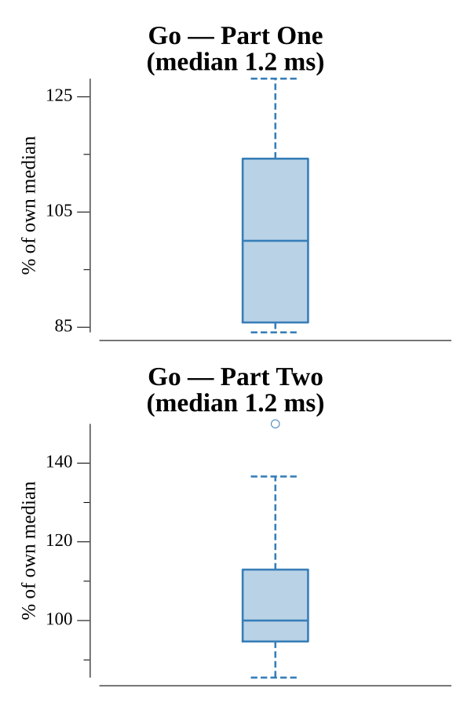

# [Day 5: If You Give A Seed A Fertilizer](https://adventofcode.com/2023/day/5)

<!-- These are helper text to make formatting the yearly readme consistent and easier...

[Day 5: If You Give A Seed A Fertilizer][rm05]
[Go][go05]

[rm05]: 05-ifYouGiveASeedAFertilizer/README.md
[go05]: 05-ifYouGiveASeedAFertilizer/go

-->

## Go

```text
────────────────────────────────────────
─   2023 Day 5: If You Give A Seed A   ─
─              Fertilizer              ─
────────────────────────────────────────
Solving (Go)…
1.0:  PASS             2.034ms
2.0:  PASS             1.230ms
```

## Run Times


