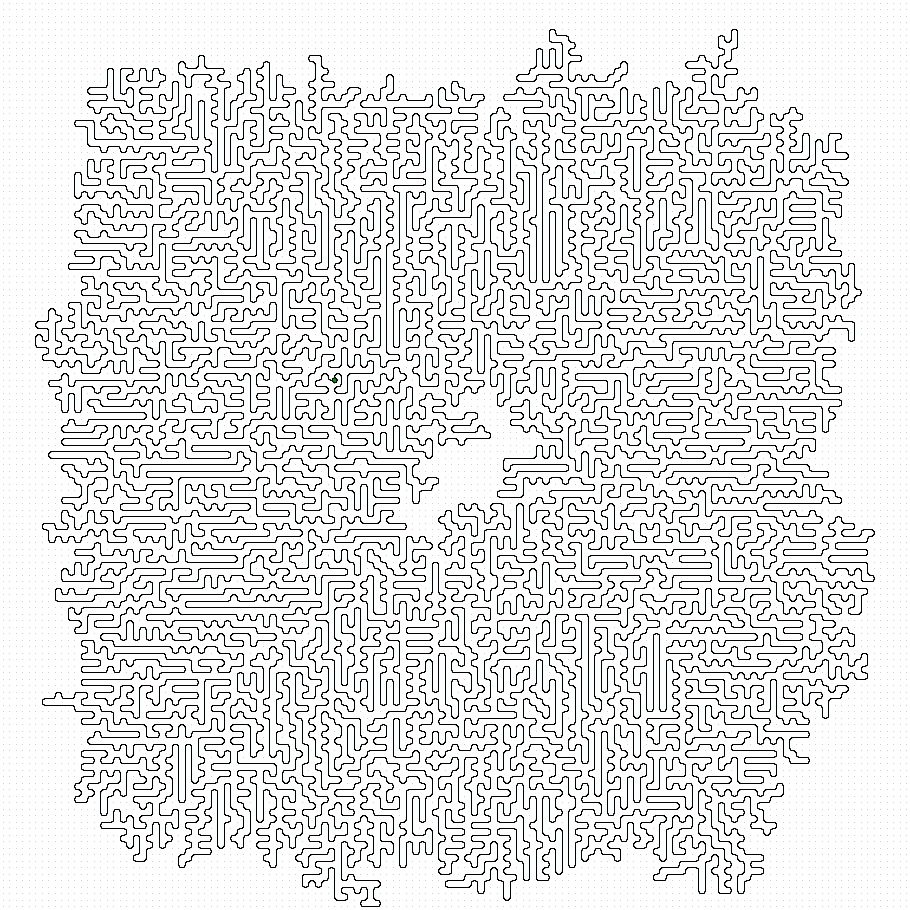
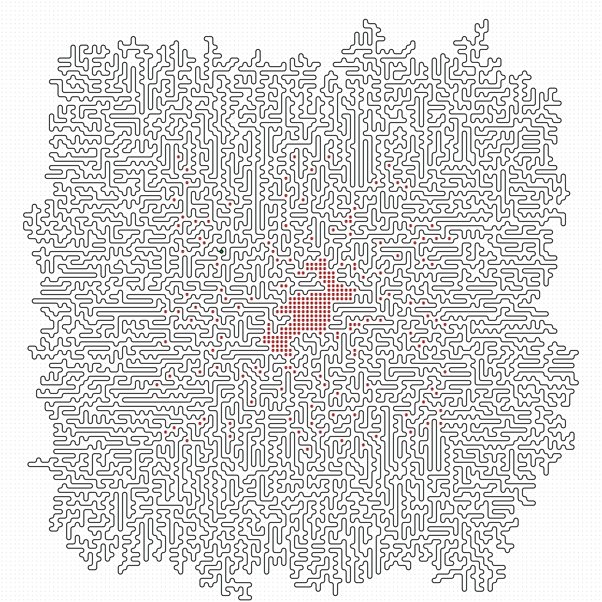

# [Day 10: Pipe Maze](https://adventofcode.com/2023/day/10)

<!-- These are helper text to make formatting the yearly readme consistent and easier...

[Day 10: Pipe Maze][rm10]
[Go][go10]
[Python][py10]

[rm10]: 10-pipeMaze/README.md
[go10]: 10-pipeMaze/go
[py10]: 10-pipeMaze/py

-->

## Go

```text
 ───────────────────
 ADVENT OF CODE 2023
 Day 10: Pipe Maze
 ───────────────────
  Test 1.1: PASS in 18 µs
  Test 1.2: PASS in 11.8 µs
  Test 2.1: PASS in 54.1 µs
  Test 2.2: PASS in 60.5 µs
  Test 2.3: PASS in 91.4 µs
    Part 1: 6942 7.9 ms
    Part 2: 297 156.4 ms
```

## Python

```text
< section intentionally left blank >
```

## Visualizations

### Part 1



### Part 2



## 2023 Run Times


