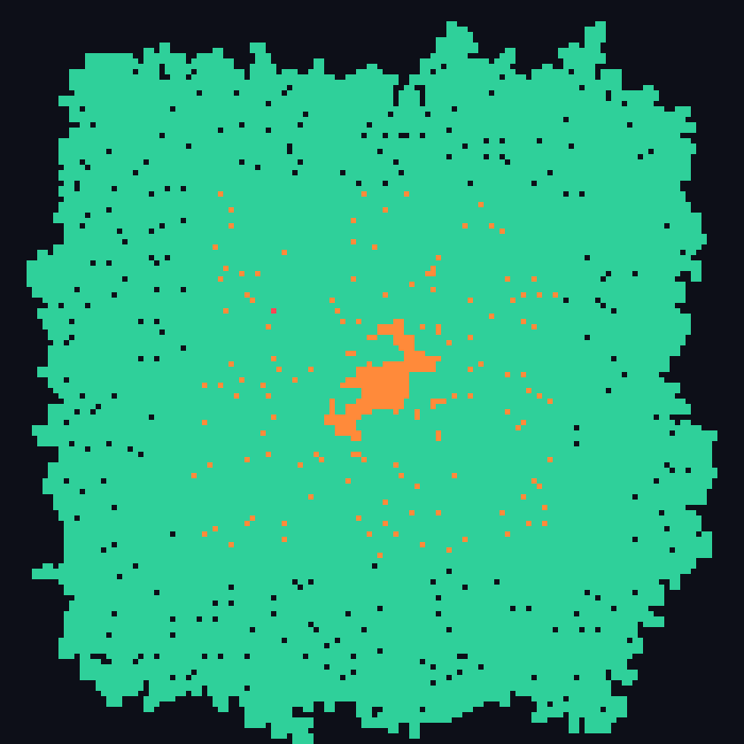
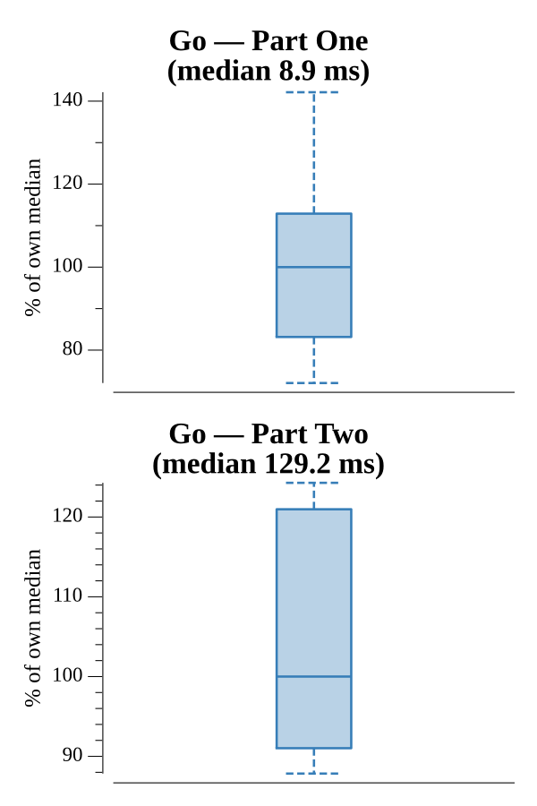

# [Day 10: Pipe Maze](https://adventofcode.com/2023/day/10)

<!-- These are helper text to make formatting the yearly readme consistent and easier...

[Day 10: Pipe Maze][rm10]
[Go][go10]

[rm10]: 10-pipeMaze/README.md
[go10]: 10-pipeMaze/go

-->

## Go

```text
────────────────────────────────────────
─        2023 Day 10: Pipe Maze        ─
────────────────────────────────────────
Solving (Go)…
1.0:  PASS            12.954ms
2.0:  PASS           228.745ms
```

## Visualization

The main loop traced through the maze (teal), starting from `S` (red), with the
tiles it encloses — the Part Two answer, found by a winding-number test — filled
in orange. Everything outside the loop is left dark.



## Run Times


