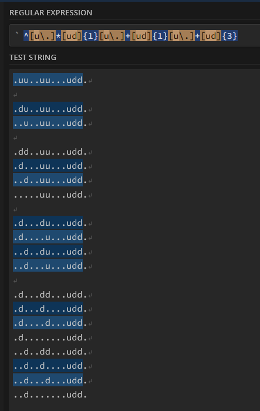

# [Day 12: Hot Springs](https://adventofcode.com/2023/day/12)

<!-- These are helper text to make formatting the yearly readme consistent and easier...

[Day 12: Hot Springs][rm12]
[Go][go12]
[Python][py12]

[rm12]: 12-hotSprings/README.md
[go12]: 12-hotSprings/go
[py12]: 12-hotSprings/py

-->

## Notes

Using regex pattern to determine if a pattern can ever be valid before spending cycles using it as a base for further combinations. This acts as a filter for recursive calls that will come. Filtering during generation skips the need to pass combinations backward for counting at the end.

I pre-process the strings when I parse the line so that I can skip symbol escaping while generating the regex. It simplifies the code quite a bit. `?` -> `u`, and `#` -> `d`.

  
[via regex101.com](https://regex101.com/r/5AQR1s/2)

## Go

```text
< section intentionally left blank >
```

## Python

```text
< section intentionally left blank >
```

## 2023 Run Times


