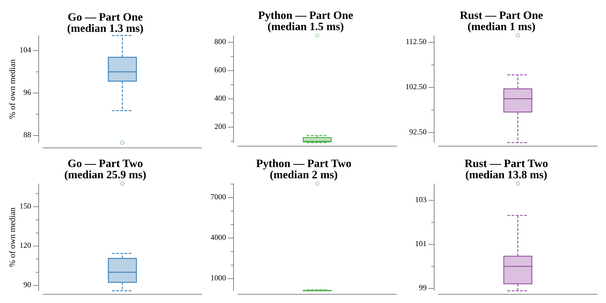

# [Day 12: Hot Springs](https://adventofcode.com/2023/day/12)

<!-- These are helper text to make formatting the yearly readme consistent and easier...

[Day 12: Hot Springs][rm12]
[Go][go12]

[rm12]: 12-hotSprings/README.md
[go12]: 12-hotSprings/go

-->

## Notes

Arrangements are counted with a memoised dynamic program over `(position in the
condition record, group index)`. At each position the cell is treated as
operational (skip) or, if it can start the next damaged group, the whole group
is consumed along with its trailing separator. Memoising on the two indices
makes each line linear in its length times its group count — no regex or string
rebuilding — so the unfolded Part Two records resolve quickly. (An earlier
version brute-forced `?` substitutions with a regex validity filter; the DP
replaces it.)

## Go

```text
────────────────────────────────────────
─       2023 Day 12: Hot Springs       ─
────────────────────────────────────────
Solving (Go)…
1.0:  PASS             7.252ms
2.0:  PASS           120.637ms
```

## Python

The same DP, expressed as a `functools.cache` recursion on `(springs, groups)`:
each call either skips an operational cell or consumes the next group with its
trailing separator, and the cache collapses the overlap. Part two `?`-joins the
pattern fivefold and repeats the groups.

```text
────────────────────────────────────────
─       2023 Day 12: Hot Springs       ─
────────────────────────────────────────
Solving (Python)…
1.0:  PASS            10.677ms
2.0:  PASS           152.111ms
```

## Rust

The recursion memoizes on `(byte offset, group index)` into a `HashMap`, working
over the pattern bytes so the group-placement checks (`contains(&b'.')`, boundary
after the run) are slice tests. Unfolding builds the fivefold byte pattern once
per line.

```text
────────────────────────────────────────
─       2023 Day 12: Hot Springs       ─
────────────────────────────────────────
Solving (Rust)…
1.0:  PASS             1.230ms
2.0:  PASS            14.472ms
```

## Run Times


