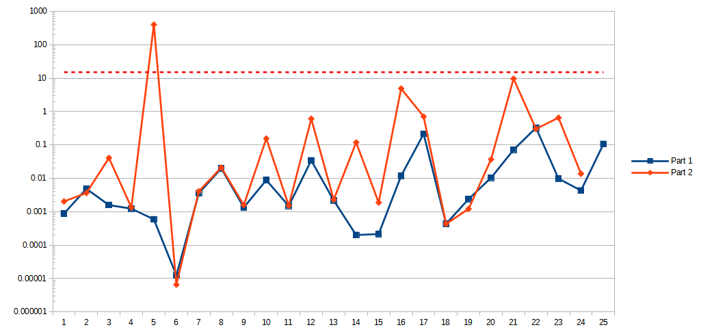

# [Day 12: Hot Springs](https://adventofcode.com/2023/day/12)

<!-- These are helper text to make formatting the yearly readme consistent and easier...

[Day 12: Hot Springs][rm12]
[Go][go12]
[Python][py12]

[rm12]: 12-hotSprings/README.md
[go12]: 12-hotSprings/go
[py12]: 12-hotSprings/py

-->

## Notes

Using regex pattern to determine if a pattern can ever be valid before spending cycles using it as a base for further combinations. This acts as a filter for recursive calls that will come. Filtering during generation skips the need to pass combinations backward for counting at the end.

I pre-process the strings when I parse the line so that I can skip symbol escaping while generating the regex. It simplifies the code quite a bit. `?` -> `u`, and `#` -> `d`.

  
[via regex101.com](https://regex101.com/r/5AQR1s/2)

## Go

### Brute Force

```text
──────────────────────────────────────────
           ADVENT OF CODE 2023
           Day 12: Hot Springs
──────────────────────────────────────────

Testing...
  1.1: PASS              0.04 ms
  1.2: PASS              0.03 ms
  1.3: PASS              0.04 ms
  1.4: PASS              0.04 ms
  1.5: PASS              0.05 ms
  1.6: PASS              0.05 ms
  2.1: PASS              0.11 ms
  2.2: PASS              0.22 ms
  2.3: PASS              0.21 ms
  2.4: PASS              0.15 ms
  2.5: PASS              0.31 ms
  2.6: PASS              0.43 ms
  2.7: PASS              1.32 ms

Solving...
    1: PASS             40.55 ms
      ⤷ 6949
    2: PASS           1536.25 ms
      ⤷ 51456609952403
```

### Brute Force, but with goroutines

```text
──────────────────────────────────────────
           ADVENT OF CODE 2023
           Day 12: Hot Springs
──────────────────────────────────────────

Testing...
  1.1: PASS              0.11 ms
  1.2: PASS              0.09 ms
  1.3: PASS              0.10 ms
  1.4: PASS              0.08 ms
  1.5: PASS              0.11 ms
  1.6: PASS              0.11 ms
  2.1: PASS              0.84 ms
  2.2: PASS              0.27 ms
  2.3: PASS              0.30 ms
  2.4: PASS              0.20 ms
  2.5: PASS              0.39 ms
  2.6: PASS              0.47 ms
  2.7: PASS              0.86 ms

Solving...
    1: PASS             37.59 ms
      ⤷ 6949
    2: PASS            683.69 ms
      ⤷ 51456609952403
```

## Python

```text
< section intentionally left blank >
```

## 2023 Run Times


