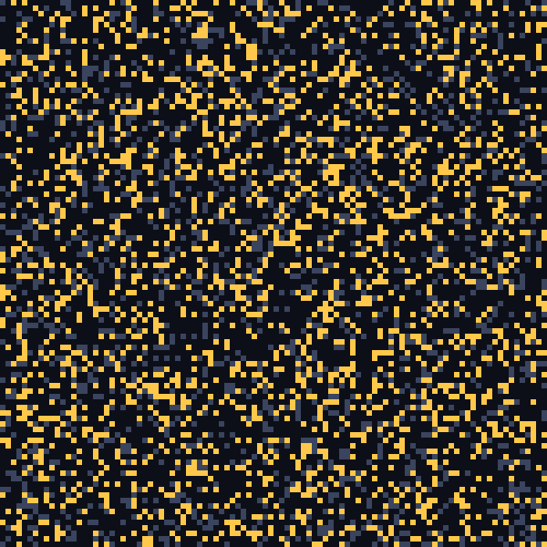
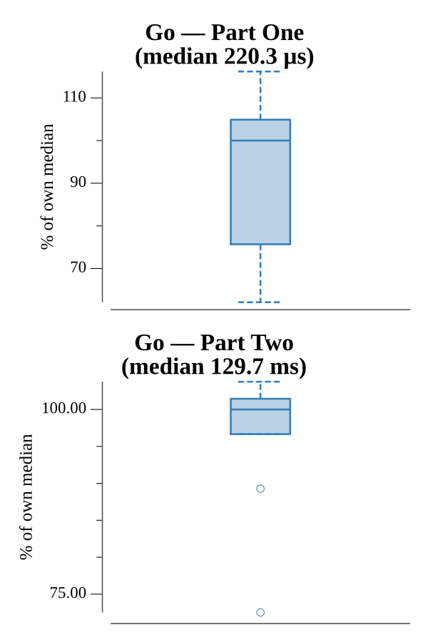

# [Day 14: Parabolic Reflector Dish](https://adventofcode.com/2023/day/14)

<!-- These are helper text to make formatting the yearly readme consistent and easier...

[Day 14: Parabolic Reflector Dish][rm14]
[Go][go14]

[rm14]: 14-parabolicReflectorDish/README.md
[go14]: 14-parabolicReflectorDish/go

-->

## Notes

Part Two runs the billion spin cycles by hashing each grid state to detect the
repeating cycle, then fast-forwarding whole cycles to the target index.

## Go

```text
────────────────────────────────────────
─2023 Day 14: Parabolic Reflector Dish ─
────────────────────────────────────────
Solving (Go)…
1.0:  PASS             0.124ms
2.0:  PASS            69.364ms
```

## Visualization

The spin cycle animated (GIF): each frame is one full N→W→S→E spin. The round
rocks (gold) roll and pile against the fixed cube rocks (slate), starting from
the scattered initial layout and settling into the repeating steady state that
the cycle-detection exploits.



## Run Times


