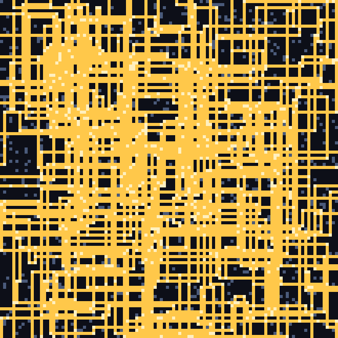
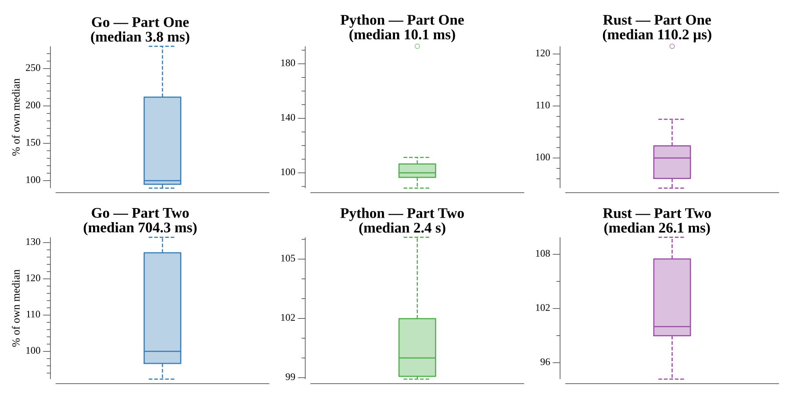

# [Day 16: The Floor Will Be Lava](https://adventofcode.com/2023/day/16)

<!-- These are helper text to make formatting the yearly readme consistent and easier...

[Day 16: The Floor Will Be Lava][rm16]
[Go][go16]

[rm16]: 16-theFloorWillBeLava/README.md
[go16]: 16-theFloorWillBeLava/go

-->

## Notes

Each of the ~440 edge entry points is an independent beam simulation, so Part
Two fans them out across `GOMAXPROCS` worker goroutines and takes the maximum
energized count.

## Go

```text
────────────────────────────────────────
─ 2023 Day 16: The Floor Will Be Lava  ─
────────────────────────────────────────
Solving (Go)…
1.0:  PASS              0.016s
2.0:  PASS              1.717s
```

## Python

A beam trace with an explicit stack and a `seen` set of `(cell, direction)` so
splitters don't loop; the energized count is the distinct cells reached. Tile
behavior is a small direction-transform table. Part two takes the max over every
edge start.

```text
────────────────────────────────────────
─ 2023 Day 16: The Floor Will Be Lava  ─
────────────────────────────────────────
Solving (Python)…
1.0:  PASS              0.011s
2.0:  PASS              2.463s
```

## Rust

The same trace, but visited states live in a flat `vec![false; h*w*4]` bitset
keyed by `(row, col, dir)`, which makes each simulation cheap enough to brute the
~440 edge starts of part two in a fraction of a second.

```text
────────────────────────────────────────
─ 2023 Day 16: The Floor Will Be Lava  ─
────────────────────────────────────────
Solving (Rust)…
1.0:  PASS             0.131ms
2.0:  PASS            28.221ms
```

## Visualization

The contraption energized by the strongest Part Two start beam. Tiles the beam
reaches glow gold; the dark cells are floor it never touches, and the blue-grey
specks are mirrors and splitters (brightened where the beam passes through
them). The dense grid of light traces how the `|` and `-` splitters fan the beam
across the whole floor.



## Run Times


