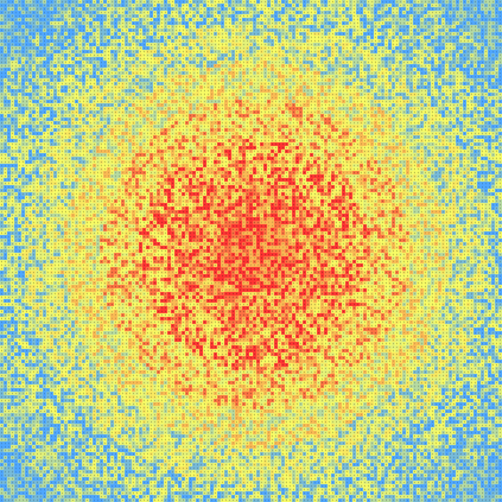

# [Day 17: Clumsy Crucible](https://adventofcode.com/2023/day/17)

<!-- These are helper text to make formatting the yearly readme consistent and easier...

[Day 17: Clumsy Crucible][rm17]
[Go][go17]
[Python][py17]

[rm17]: 17-clumsyCrucible/README.md
[go17]: 17-clumsyCrucible/go
[py17]: 17-clumsyCrucible/py

-->
## Notes

Input visualization:


## Go

```text
──────────────────────────────────────────
           ADVENT OF CODE 2023            
         Day 17: Clumsy Crucible          
──────────────────────────────────────────
          
Testing...
  1.1: PASS              2.23 ms
  2.1: PASS              1.41 ms
  2.2: PASS              0.50 ms
          
Solving...
    1: PASS            312.83 ms
      ⤷ 684
    2: PASS            693.58 ms
      ⤷ 822
```

## Python

Dijkstra with `heapq` over states `(row, col, axis)`. Because the crucible must
turn onto the perpendicular axis, each transition expands every `lo..hi` straight
step at once — so the turn/run limits are encoded without a run-length dimension.
Parts differ only in the `(lo, hi)` bounds: `(1, 3)` and `(4, 10)`.

```text
──────────────────────────────────────────
           ADVENT OF CODE 2023
         Day 17: Clumsy Crucible
──────────────────────────────────────────

Solving (Python)…
1.0:  PASS           167.397ms
2.0:  PASS           319.184ms
```

## Rust

The same axis-state Dijkstra, using a `BinaryHeap` with `Reverse` as a min-heap
and a flat `best[axis][r][c]` cost table. The compact state space keeps both
crucible variants in the low tens of milliseconds.

```text
──────────────────────────────────────────
           ADVENT OF CODE 2023
         Day 17: Clumsy Crucible
──────────────────────────────────────────

Solving (Rust)…
1.0:  PASS             8.296ms
2.0:  PASS            16.146ms
```

## 2023 Run Times


