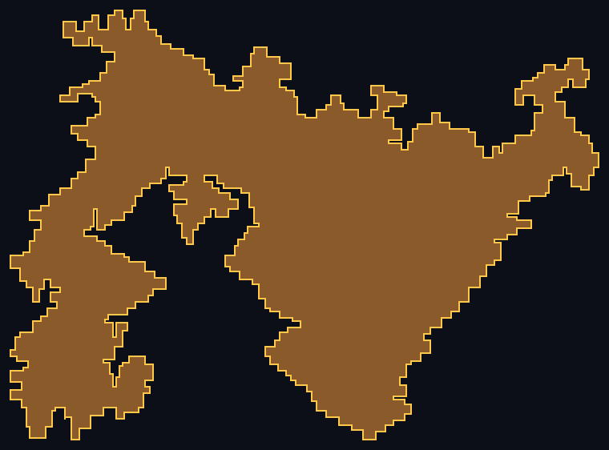
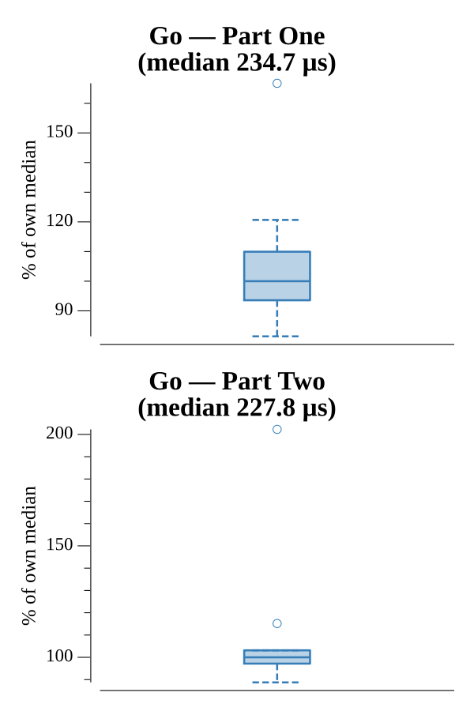

# [Day 18: Lavaduct Lagoon](https://adventofcode.com/2023/day/18)

<!-- These are helper text to make formatting the yearly readme consistent and easier...

[Day 18: Lavaduct Lagoon][rm18]
[Go][go18]

[rm18]: 18-lavaductLagoon/README.md
[go18]: 18-lavaductLagoon/go

-->

## Notes

Both parts compute the dug-out volume with the shoelace formula over the raw
corner vertices plus Pick's theorem: `area = shoelace + perimeter/2 + 1`. This
counts the trench itself exactly and handles the enormous hex-decoded Part Two
plan without rasterising anything.

## Go

```text
────────────────────────────────────────
─     2023 Day 18: Lavaduct Lagoon     ─
────────────────────────────────────────
Solving (Go)…
1.0:  PASS           281.678µs
2.0:  PASS           232.910µs
```

## Visualization

The Part One dig plan: the trench boundary (gold) enclosing the excavated lagoon
(brown), filled by a scanline point-in-polygon test. Part Two's hex plan
encloses trillions of cubic metres, far too large to raster, so the picture uses
the Part One dig.



## Run Times


