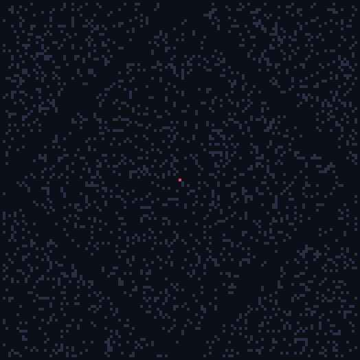
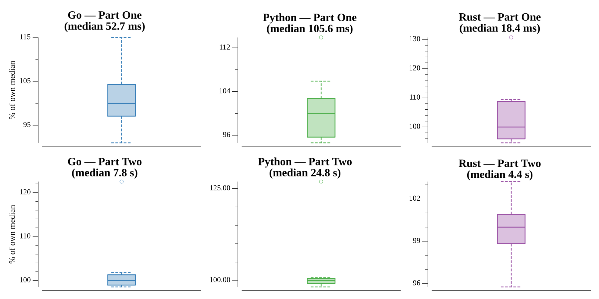

# [Day 21: Step Counter](https://adventofcode.com/2023/day/21)

<!-- These are helper text to make formatting the yearly readme consistent and easier...

[Day 21: Step Counter][rm21]
[Go][go21]

[rm21]: 21-stepCounter/README.md
[go21]: 21-stepCounter/go

-->

## Notes

Part Two exploits that the reachable count grows quadratically once the frontier
clears the starting tile: BFS is run just far enough to sample the count at three
step offsets one grid-width apart, then a quadratic is fitted and evaluated at
the full 26 501 365-step target.

## Go

```text
────────────────────────────────────────
─      2023 Day 21: Step Counter       ─
────────────────────────────────────────
Solving (Go)…
1.0:  PASS              0.040s
2.0:  PASS              5.759s
```

## Python

Part one is a bounded set-BFS to 64 steps. Part two runs the frontier BFS on the
tiled grid (positions wrap by modulo) to three samples one grid-width apart, then
fits a quadratic and evaluates it at the full target. The pure-set BFS is the
plain expression of the idea; it is correct but the slowest of the three.

```text
────────────────────────────────────────
─      2023 Day 21: Step Counter       ─
────────────────────────────────────────
Solving (Python)…
1.0:  PASS              0.078s
2.0:  PASS             24.437s
```

## Rust

The same BFS and quadratic fit over a `HashSet` frontier with `rem_euclid`
wrapping for the infinite grid. The tighter set operations bring part two in
under five seconds.

```text
────────────────────────────────────────
─      2023 Day 21: Step Counter       ─
────────────────────────────────────────
Solving (Rust)…
1.0:  PASS              0.025s
2.0:  PASS              4.613s
```

## Visualization

The reachable frontier spreading across the garden over 64 steps (GIF). Each
frame shows the plots reachable in exactly that many steps — teal over the rocks
(slate), start marked red. The step parity means only every other tile lights up,
producing the growing diamond the quadratic extrapolation is built on.



## Run Times


