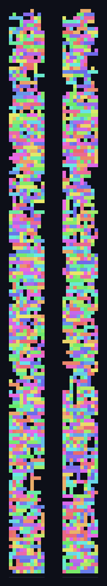
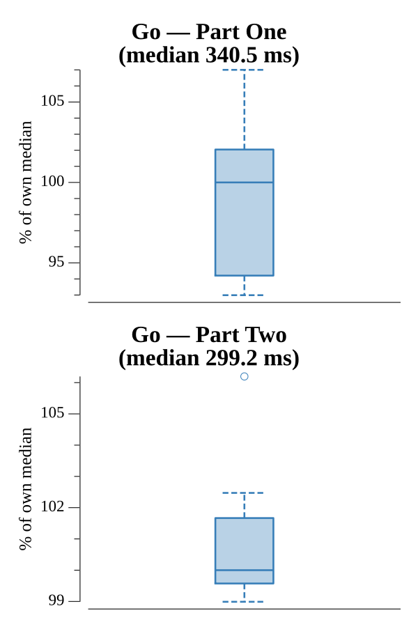

# [Day 22: Sand Slabs](https://adventofcode.com/2023/day/22)

<!-- These are helper text to make formatting the yearly readme consistent and easier...

[Day 22: Sand Slabs][rm22]
[Go][go22]

[rm22]: 22-sandSlabs/README.md
[go22]: 22-sandSlabs/go

-->

## Go

```text
────────────────────────────────────────
─       2023 Day 22: Sand Slabs        ─
────────────────────────────────────────
Solving (Go)…
1.0:  PASS           304.984ms
2.0:  PASS           296.814ms
```

## Visualization

The settled brick pile in the two side elevations the puzzle uses: looking down
the y axis (x vs z, left) and down the x axis (y vs z, right). Each brick keeps a
stable colour across both views, so the packed tower structure after everything
falls is visible from either side.



## Run Times


