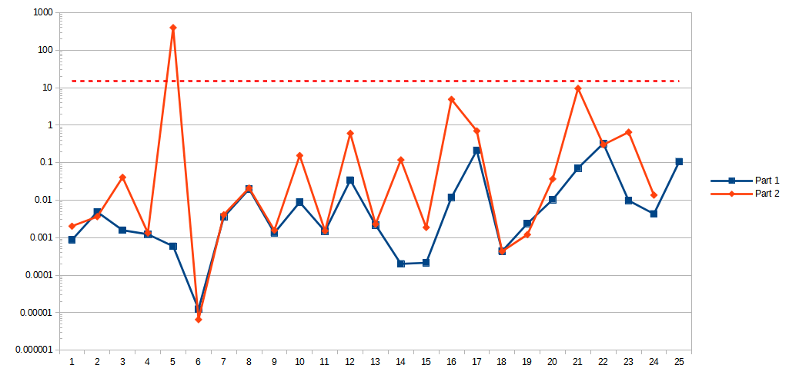

# Advent of Code: 2023

[Advent of Code 2023](https://adventofcode.com/2023) exercise solutions.

<!-- ★ ☆ -->

| Title                                         | Stars | Solutions  |
|-----------------------------------------------|:-----:|------------|
| [Day 1: Trebuchet?!][rm1]                     |  ⭐⭐   | [Go][go1]  |
| [Day 2: Cube Conundrum][rm2]                  |  ⭐⭐   | [Go][go2]  |
| [Day 3: Gear Ratios][rm3]                     |  ⭐⭐   | [Go][go3]  |
| [Day 4: Scratchcards][rm4]                    |  ⭐⭐   | [Go][go4]  |
| [Day 5: If You Give A Seed A Fertilizer][rm5] |  ⭐⭐   | [Go][go5]  |
| [Day 6: Wait For It][rm6]                     |  ⭐⭐   | [Go][go6]  |
| [Day 7: Camel Cards][rm7]                     |  ⭐⭐   | [Go][go7]  |
| [Day 8: Haunted Wasteland][rm8]               |  ⭐⭐   | [Go][go8]  |
| [Day 9: Mirage Maintenance][rm9]              |  ⭐⭐   | [Go][go9]  |
| [Day 10: Pipe Maze][rm10]                     |  ⭐⭐   | [Go][go10] |
| [Day 11: Cosmic Expansion][rm11]              |  ⭐⭐   | [Go][go11] |
| [Day 12: Hot Springs][rm12]                   |  ⭐⭐   | [Go][go12] |
| [Day 13: Point of Incidence][rm13]            |  ⭐⭐   | [Go][go13] |
| [Day 14: Parabolic Reflector Dish][rm14]      |  ⭐⭐   | [Go][go14] |
| [Day 15: Lens Library][rm15]                  |  ⭐⭐   | [Go][go15] |
| [Day 16: The Floor Will Be Lava][rm16]        |  ⭐⭐   | [Go][go16] |
| [Day 17: Clumsy Crucible][rm17]               |  ⭐⭐   | [Go][go17] |
| [Day 18: Lavaduct Lagoon][rm18]               |  ⭐⭐   | [Go][go18] |
| [Day 19: Aplenty][rm19]                       |  ⭐⭐   | [Go][go19] |
| [Day 20: Pulse Propagation][rm20]             |  ⭐⭐   | [Go][go20] |
| [Day 21: Step Counter][rm21]                  |  ⭐⭐   | [Go][go21] |
| [Day 22: Sand Slabs][rm22]                    |  ☆ ☆  | [Go][go22] |
| [Day 23: A Long Walk][rm23]                   |  ☆ ☆  | [Go][go23] |
| [Day 24: Never Tell Me The Odds][rm24]        |  ☆ ☆  | [Go][go24] |
| [Day 25: Snowverload][rm25]                   |  ☆ ☆  | [Go][go25] |

## 2023 Run Times



## [2023 Personal Leaderboard](https://adventofcode.com/2023/leaderboard/self)

```text
      --------Part 1--------   --------Part 2--------
Day       Time   Rank  Score       Time   Rank  Score
 21       >24h  24613      0       >24h  14483      0
 20       >24h  16910      0       >24h  14229      0
 19       >24h  29760      0       >24h  22746      0
 18       >24h  29612      0       >24h  24797      0
 17       >24h  25333      0       >24h  24225      0
 16       >24h  34916      0       >24h  34508      0
 15       >24h  39295      0       >24h  35917      0
 14       >24h  38152      0       >24h  31691      0
 13       >24h  36838      0       >24h  32847      0
 12       >24h  35413      0       >24h  25545      0
 11       >24h  46886      0       >24h  45035      0
 10       >24h  42307      0       >24h  32659      0
  9       >24h  62366      0       >24h  61519      0
  8   22:38:21  56748      0       >24h  48635      0
  7       >24h  58886      0       >24h  54630      0
  6   09:45:18  45320      0   10:02:29  44478      0
  5       >24h  89278      0       >24h  63991      0
  4   01:48:00  18992      0   02:26:02  16482      0
  3   23:40:28  78694      0       >24h  67807      0
  2   00:47:33   9949      0   00:53:01   9117      0
  1   00:30:29  10081      0   02:13:25  12194      0
```

<!-- reference links -->

[rm1]: 01-trebuchet?/README.md
[go1]: 01-trebuchet?/go
[rm2]: 02-cubeConundrum/README.md
[go2]: 02-cubeConundrum/go
[rm3]: 03-gearRatios/README.md
[go3]: 03-gearRatios/go
[rm4]: 04-scratchcards/README.md
[go4]: 04-scratchcards/go
[rm5]: 05-ifYouGiveASeedAFertilizer/README.md
[go5]: 05-ifYouGiveASeedAFertilizer/go
[rm6]: 06-waitForIt/README.md
[go6]: 06-waitForIt/go
[rm7]: 07-camelCards/README.md
[go7]: 07-camelCards/go
[rm8]: 08-hauntedWasteland/README.md
[go8]: 08-hauntedWasteland/go
[rm9]: 09-mirageMaintenance/README.md
[go9]: 09-mirageMaintenance/go
[rm10]: 10-pipeMaze/README.md
[go10]: 10-pipeMaze/go
[rm11]: 11-cosmicExpansion/README.md
[go11]: 11-cosmicExpansion/go
[rm12]: 12-hotSprings/README.md
[go12]: 12-hotSprings/go
[rm13]: 13-pointOfIncidence/README.md
[go13]: 13-pointOfIncidence/go
[rm14]: 14-parabolicReflectorDish/README.md
[go14]: 14-parabolicReflectorDish/go
[rm15]: 15-lensLibrary/README.md
[go15]: 15-lensLibrary/go
[rm16]: 16-theFloorWillBeLava/README.md
[go16]: 16-theFloorWillBeLava/go
[rm17]: 17-clumsyCrucible/README.md
[go17]: 17-clumsyCrucible/go
[rm18]: 18-lavaductLagoon/README.md
[go18]: 18-lavaductLagoon/go
[rm19]: 19-aplenty/README.md
[go19]: 19-aplenty/go
[rm20]: 20-pulsePropagation/README.md
[go20]: 20-pulsePropagation/go
[rm21]: 21-stepCounter/README.md
[go21]: 21-stepCounter/go
[rm22]: 22-sandSlabs/README.md
[go22]: 22-sandSlabs/go
[rm23]: 23-aLongWalk/README.md
[go23]: 23-aLongWalk/go
[rm24]: 24-neverTellMeTheOdds/README.md
[go24]: 24-neverTellMeTheOdds/go
[rm25]: 25-snowverload/README.md
[go25]: 25-snowverload/go
