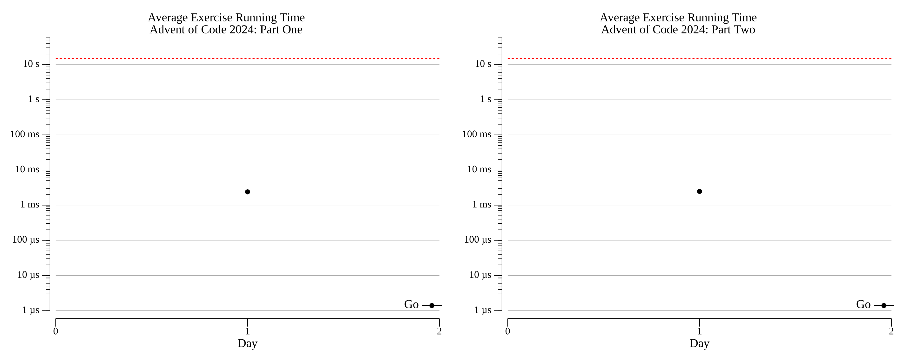

# [Day 1: Historian Hysteria](https://adventofcode.com/2024/day/1)

<!-- These are helper text to make formatting the yearly readme consistent and easier...

[Day 1: Historian Hysteria][rm1]
[Go][go1]
[Python][py1]

[rm1]: 01-historianHysteria/README.md
[go1]: 01-historianHysteria/go
[py1]: 01-historianHysteria/py

-->

## Go

```text
──────────────────────────────────────────
           ADVENT OF CODE 2024            
        Day 1: Historian Hysteria         
──────────────────────────────────────────
Solving (Go)...
  1.1: PASS              1.434ms
      ⤷ 2164381
  2.1: PASS              1.439ms
      ⤷ 20719933
```

## Python

```text
< section intentionally left blank >
```

## 2024 Run Times


