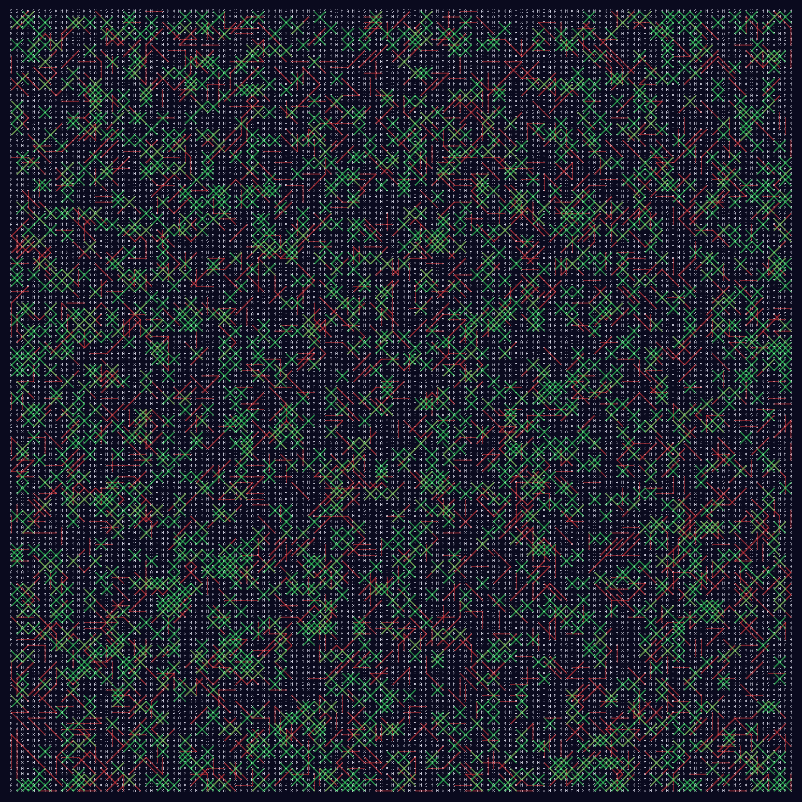

# [Day 4: Ceres Search](https://adventofcode.com/2024/day/4)

<!-- These are helper text to make formatting the yearly readme consistent and easier...

[Day 4: Ceres Search][rm4]
[Go][go4]
[Python][py4]
[Lua][lua4]

[rm4]: 04-ceresSearch/README.md
[go4]: 04-ceresSearch/go
[py4]: 04-ceresSearch/py
[lua4]: 04-ceresSearch/lua

-->

## Go

```text
────────────────────────────────────────
─       2024 Day 4: Ceres Search       ─
────────────────────────────────────────
Solving (Go)…
1.0:  PASS           801.636µs
      ⤷ 2370
2.0:  PASS           285.085µs
      ⤷ 1908
```

## Python

```text
────────────────────────────────────────
─       2024 Day 4: Ceres Search       ─
────────────────────────────────────────
Solving (Python)…
1.0:  PASS            19.518ms
      ⤷ 2370
2.0:  PASS             5.857ms
      ⤷ 1908
```

## Lua

```text
────────────────────────────────────────
─       2024 Day 4: Ceres Search       ─
────────────────────────────────────────
Solving (Lua)…
1.0:  PASS            35.899ms
      ⤷ 2370
2.0:  PASS            11.597ms
      ⤷ 1908
```

## Visualization



## 2024 Run Times


