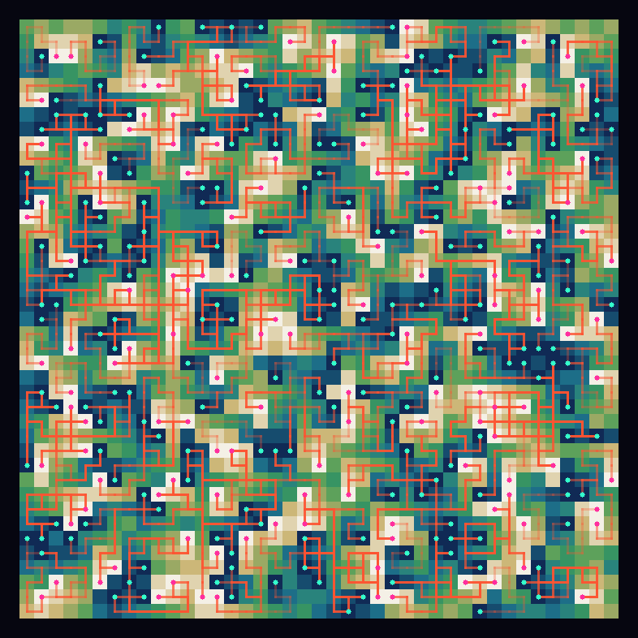

# [Day 10: Hoof It](https://adventofcode.com/2024/day/10)

<!-- These are helper text to make formatting the yearly readme consistent and easier...

[Day 10: Hoof It][rm10]
[Go][go10]
[Python][py10]
[Lua][lua10]

[rm10]: 10-hoofIt/README.md
[go10]: 10-hoofIt/go
[py10]: 10-hoofIt/py
[lua10]: 10-hoofIt/lua

-->

## Go

```text
────────────────────────────────────────
─         2024 Day 10: Hoof It         ─
────────────────────────────────────────
Solving (Go)…
1.0:  PASS           405.595µs
      ⤷ 548
2.0:  PASS           395.284µs
      ⤷ 1252
```

## Python

```text
────────────────────────────────────────
─         2024 Day 10: Hoof It         ─
────────────────────────────────────────
Solving (Python)…
1.0:  PASS             7.581ms
      ⤷ 548
2.0:  PASS             4.434ms
      ⤷ 1252
```

## Lua

```text
────────────────────────────────────────
─         2024 Day 10: Hoof It         ─
────────────────────────────────────────
Solving (Lua)…
1.0:  PASS             6.655ms
      ⤷ 548
2.0:  PASS             3.002ms
      ⤷ 1252
```

## Visualization



## 2024 Run Times


