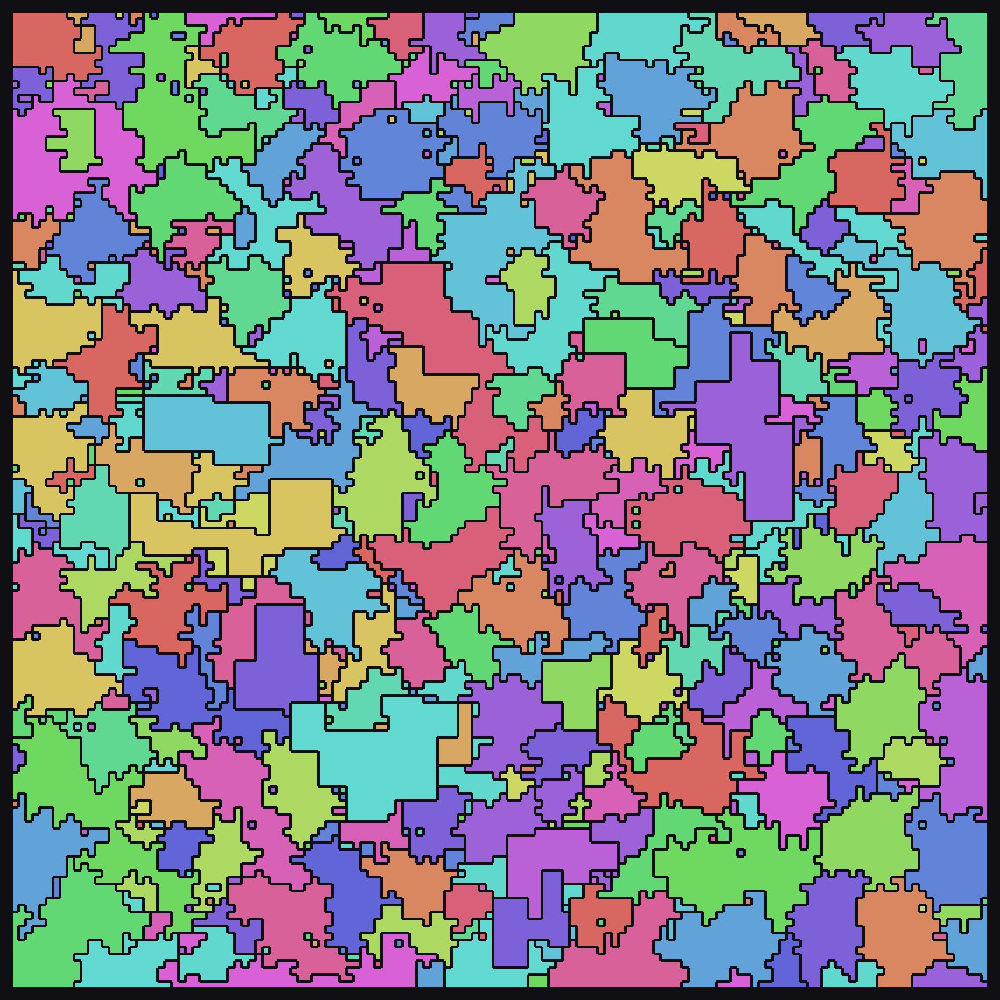

# [Day 12: Garden Groups](https://adventofcode.com/2024/day/12)

<!-- These are helper text to make formatting the yearly readme consistent and easier...

[Day 12: Garden Groups][rm12]
[Go][go12]
[Python][py12]
[Lua][lua12]

[rm12]: 12-gardenGroups/README.md
[go12]: 12-gardenGroups/go
[py12]: 12-gardenGroups/py
[lua12]: 12-gardenGroups/lua

-->

## Go

```text
────────────────────────────────────────
─      2024 Day 12: Garden Groups      ─
────────────────────────────────────────
Solving (Go)…
1.0:  PASS             2.939ms
      ⤷ 1483212
2.0:  PASS             2.127ms
      ⤷ 897062
```

## Python

```text
────────────────────────────────────────
─      2024 Day 12: Garden Groups      ─
────────────────────────────────────────
Solving (Python)…
1.0:  PASS           150.619ms
      ⤷ 1483212
2.0:  PASS           153.663ms
      ⤷ 897062
```

## Lua

```text
────────────────────────────────────────
─      2024 Day 12: Garden Groups      ─
────────────────────────────────────────
Solving (Lua)…
1.0:  PASS           157.867ms
      ⤷ 1483212
2.0:  PASS           149.695ms
      ⤷ 897062
```

## Visualization



## 2024 Run Times


