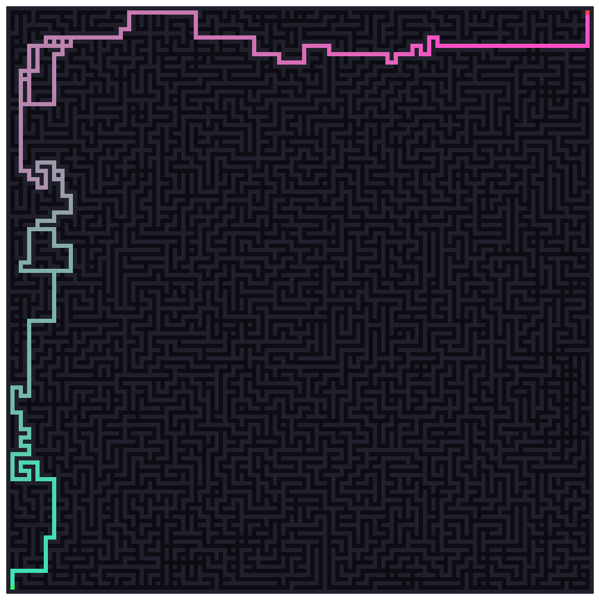

# [Day 16: Reindeer Maze](https://adventofcode.com/2024/day/16)

<!-- These are helper text to make formatting the yearly readme consistent and easier...

[Day 16: Reindeer Maze][rm16]
[Go][go16]

[rm16]: 16-reindeerMaze/README.md
[go16]: 16-reindeerMaze/go

-->

## Go

```text
────────────────────────────────────────
─      2024 Day 16: Reindeer Maze      ─
────────────────────────────────────────
Solving (Go)…
1.0:  PASS            53.729ms
      ⤷ 85420
2.0:  PASS            51.218ms
      ⤷ 492
```

## Visualization



## 2024 Run Times


