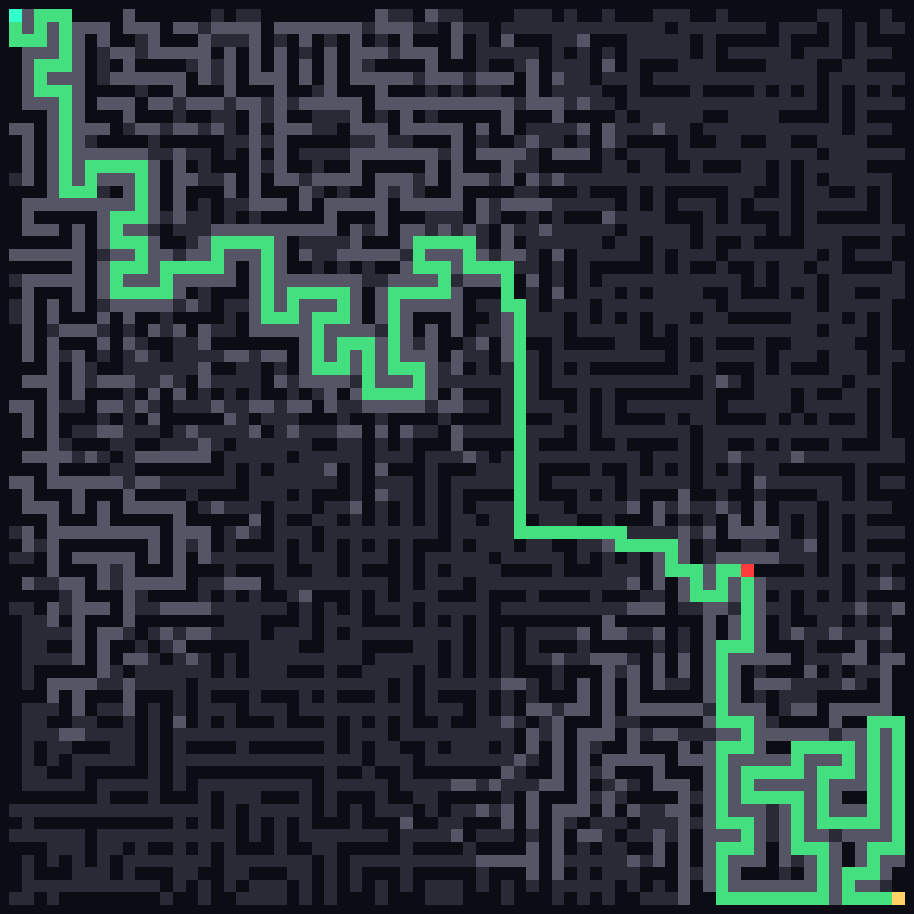

# [Day 18: RAM Run](https://adventofcode.com/2024/day/18)

<!-- These are helper text to make formatting the yearly readme consistent and easier...

[Day 18: RAM Run][rm18]
[Go][go18]

[rm18]: 18-rAMRun/README.md
[go18]: 18-rAMRun/go

-->

## Go

```text
────────────────────────────────────────
─         2024 Day 18: RAM Run         ─
────────────────────────────────────────
Solving (Go)…
1.0:  PASS             4.474ms
      ⤷ 292
2.0:  PASS             8.089ms
      ⤷ 58,44
```

## Visualization



## 2024 Run Times


