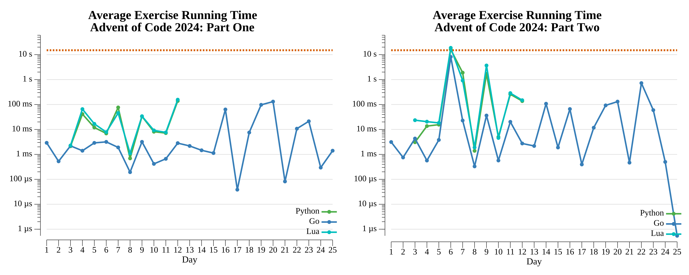

# [Day 21: Keypad Conundrum](https://adventofcode.com/2024/day/21)

<!-- These are helper text to make formatting the yearly readme consistent and easier...

[Day 21: Keypad Conundrum][rm21]
[Go][go21]

[rm21]: 21-keypadConundrum/README.md
[go21]: 21-keypadConundrum/go

-->

## Go

```text
────────────────────────────────────────
─    2024 Day 21: Keypad Conundrum     ─
────────────────────────────────────────
Solving (Go)…
1.0:  PASS            57.868µs
      ⤷ 176650
2.0:  PASS           736.895µs
      ⤷ 217698355426872
```

## 2024 Run Times


