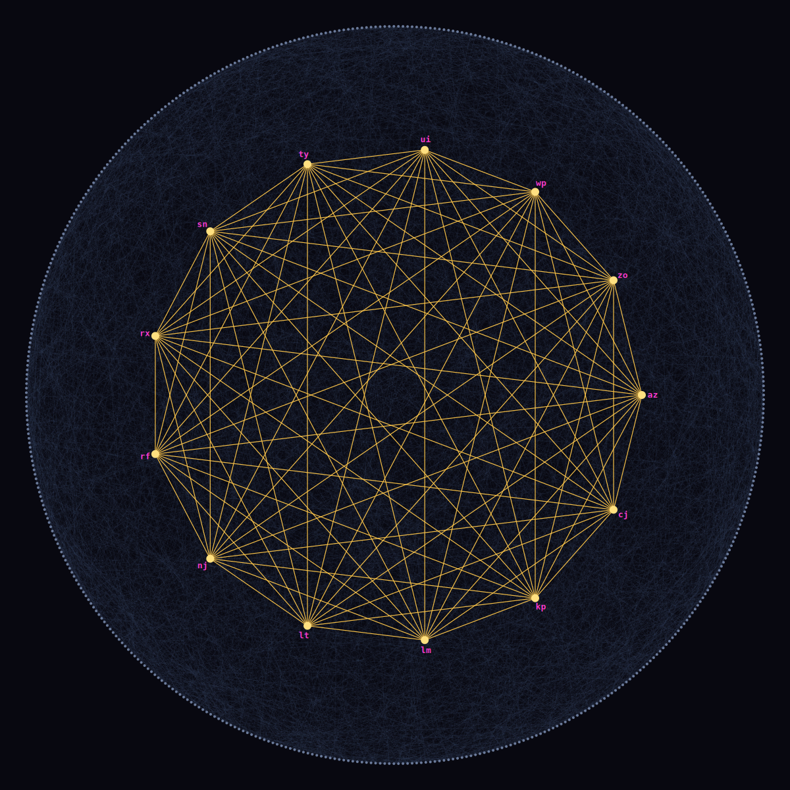

# [Day 23: LAN Party](https://adventofcode.com/2024/day/23)

<!-- These are helper text to make formatting the yearly readme consistent and easier...

[Day 23: LAN Party][rm23]
[Go][go23]

[rm23]: 23-lANParty/README.md
[go23]: 23-lANParty/go

-->

## Go

```text
────────────────────────────────────────
─        2024 Day 23: LAN Party        ─
────────────────────────────────────────
Solving (Go)…
1.0:  PASS            13.874ms
      ⤷ 1230
2.0:  PASS            48.562ms
      ⤷ az,cj,kp,lm,lt,nj,rf,rx,sn,ty,ui,wp,zo
```

## Visualization



## 2024 Run Times


