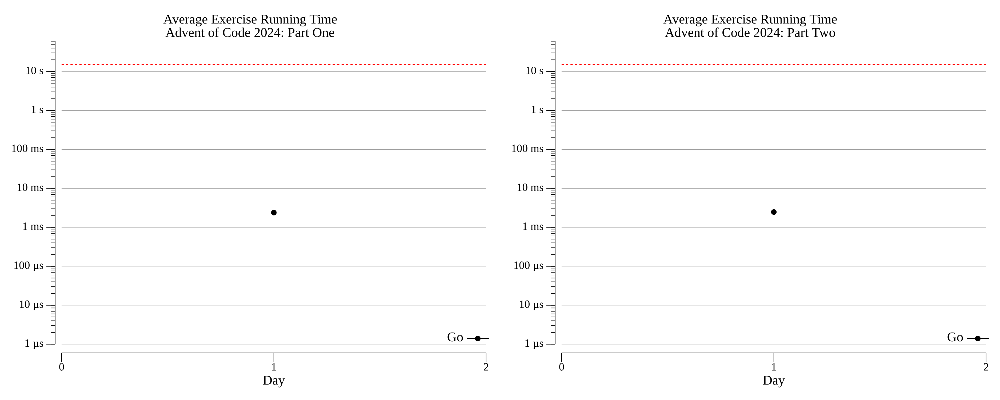

# Advent of Code: 2024

[Advent of Code 2024](https://adventofcode.com/2024) exercise solutions.

<!-- ★ ☆ -->

| Title                            | Stars | Solutions |
| -------------------------------- | :---: | --------- |
| [Day 1: Historian Hysteria][rm1] |  ⭐⭐   | [Go][go1] |
| [Day 2: Red-Nosed Reports][rm2]  |  ⭐⭐   | [Go][go2] |
| Day 3                            |  ☆☆   |           |
| Day 4                            |  ☆☆   |           |
| Day 5                            |  ☆☆   |           |
| Day 6                            |  ☆☆   |           |
| Day 7                            |  ☆☆   |           |
| Day 8                            |  ☆☆   |           |
| Day 9                            |  ☆☆   |           |
| Day 10                           |  ☆☆   |           |
| Day 11                           |  ☆☆   |           |
| Day 12                           |  ☆☆   |           |
| Day 13                           |  ☆☆   |           |
| Day 14                           |  ☆☆   |           |
| Day 15                           |  ☆☆   |           |
| Day 16                           |  ☆☆   |           |
| Day 17                           |  ☆☆   |           |
| Day 18                           |  ☆☆   |           |
| Day 19                           |  ☆☆   |           |
| Day 20                           |  ☆☆   |           |
| Day 21                           |  ☆☆   |           |
| Day 22                           |  ☆☆   |           |
| Day 23                           |  ☆☆   |           |
| Day 24                           |  ☆☆   |           |
| Day 25                           |  ☆☆   |           |

## 2024 Run Times



## [2024 Personal Leaderboard](https://adventofcode.com/2024/leaderboard/self)

```text
TODO
```

<!-- reference links -->

[rm1]: 01-historianHysteria/README.md
[go1]: 01-historianHysteria/go
[rm2]: 02-red-NosedReports/README.md
[go2]: 02-red-NosedReports/go
