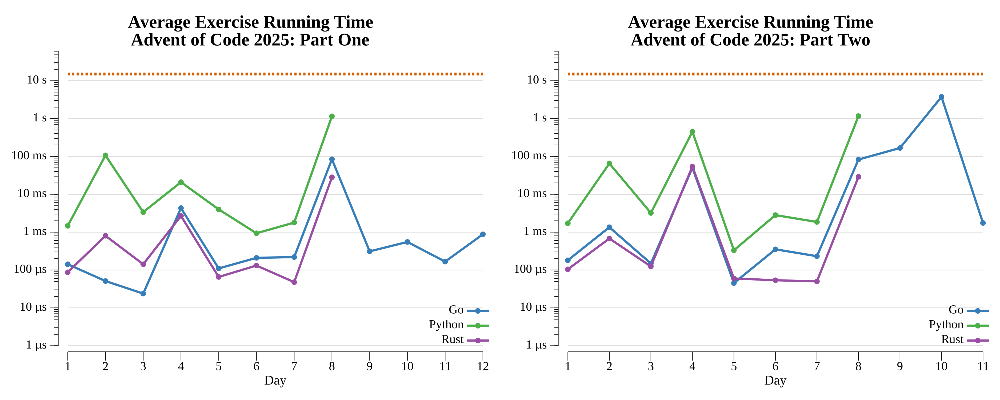

# [Day 8: Playground](https://adventofcode.com/2025/day/8)

<!-- These are helper text to make formatting the yearly readme consistent and easier...

[Day 8: Playground][rm8]
[Go][go8]
[Python][py8]

[rm8]: 08-playground/README.md
[go8]: 08-playground/go
[py8]: 08-playground/py

-->

## Go

```text
──────────────────────────────────────────
           ADVENT OF CODE 2025            
            Day 8: Playground             
──────────────────────────────────────────
Solving (Go)...
  1.1: PASS             86.143ms
      ⤷ 352584
  2.1: PASS             81.296ms
      ⤷ 9617397716
```

## Python

All pairwise squared distances are sorted shortest first and fed to a union-find.
Part one connects the k shortest wires and multiplies the three largest circuit
sizes; part two is Kruskal's MST — connect merging edges until the graph is one
tree, and the last merging junctions' x-coordinates multiply to the answer.

```text
──────────────────────────────────────────
           ADVENT OF CODE 2025
            Day 8: Playground
──────────────────────────────────────────

Solving (Python)…
1.0:  PASS             1.052s
2.0:  PASS             1.046s
```

## Rust

The same union-find over sorted squared distances, kept in `i64` and driven by a
path-halving `Dsu`. With ~500k edges for the full input it finishes an order of
magnitude faster than the interpreted version.

```text
──────────────────────────────────────────
           ADVENT OF CODE 2025
            Day 8: Playground
──────────────────────────────────────────

Solving (Rust)…
1.0:  PASS            24.659ms
2.0:  PASS            22.522ms
```

## 2025 Run Times


